# QA-rapport: Läsresan (issue #403, epic #398)

**Datum:** 2026-10-05 · **Gren:** `epic/l-sresan-motor-karta-l-svy-l-rarstatisti-f76b2f` @ `3a0cdab`
(kärnan #399, kartan #400, läsvyn #401, lärarvyn #402, validatorn #411 och innehållsbanken #404 med 42 texter)
**Testare:** Tester-agent (Claude) · **Ingen merge till main. Inga regler deployade. Ingen produktionsdata skriven.**

## Sammanfattning

| | Resultat |
| --- | --- |
| Acceptanstester 1–10 (spec §26) | **10/10 PASS** |
| Extra kontroller (3 viewports, svarslås, avbruten text) | **PASS** |
| Degradering utan deployad `lasresaAttempts`-regel (prod-läget) | **PASS** |
| Regression: Plugga, Läsuppdrag, läsförståelse, Skattjakten, shoppen, lärarsidans flikar | **PASS** |
| Bootgraf (statisk från `app.js`) | **PASS**: identisk med main, 133 filer, ingen Läsresan-modul |
| Moduler under ~400 rader | **PASS**: alla ändrade JS-filer ≤ 380 rader (`styles.css` var redan stor innan) |
| `node --test`, hela sviten via emulators:exec (auth+firestore) | **774/775**. Det enda felet finns redan på main (se F5) |
| `node --test` utan emulator (`test/*.test.js` minus regeltester) | **705/705** · Läsresan-testerna **66/66** |
| Firestore-regeltester (emulator) | **61/61** |

Inga blockerande buggar hittades. Fem iakttagelser finns under [Fynd](#fynd); F1 bör leaden ta ställning till före live.

---

## Testmiljö och metod

All E2E kördes i webbläsaren mot **Firebase-emulatorerna** (Auth + Firestore), med appen oförändrad:

1. `firebase emulators:start --only auth,firestore --project pluggportalen-so-2026` (Java 21).
2. `node seed/seed.mjs` (ämnen/områden) och sedan **`node admin/qa-lasresan-seed.mjs`** (testkonton och
   Läsresan-scenarier), båda med `FIRESTORE_EMULATOR_HOST=127.0.0.1:8080 FIREBASE_AUTH_EMULATOR_HOST=127.0.0.1:9099 GCLOUD_PROJECT=pluggportalen-so-2026`.
   Seed-skriptet vägrar köra utan emulatorvariablerna.
3. **`PORT=8000 node admin/qa-emulator-server.mjs`**: samma som `server.mjs`, men byter `src/firebase-config.js`
   mot en variant som anropar `connectFirestoreEmulator`/`connectAuthEmulator`. Ingen appfil ändras.
4. Headless Chrome mot `http://localhost:8000`. Inloggning sker via det riktiga formuläret som `elev1`/`lilla123`
   och läraren `qalarare`/`lilla123`.

**Seedning (enligt issuen):** tester som kräver många texter seedas genom att sätta `studentData.lasresa` direkt
(`admin/qa-lasresan-seed.mjs`, listan `SCENARIER`). Exempel: `qa-skogen19` har `stepInWorld: 19`, nivå 4 och 19 texter.
Klassen `qa-klass` ("QA-klass 4A") har 10 elever, bland dem en som inte har börjat och en med HTML i namnet.

**Två körsätt:**
- **UI**: riktiga klick på kartan och svarsknapparna, hela slutför-flödet (test 1, 2, 3 i UI, 7, 8, 10 och extrakontrollerna).
- **Brygga**: i sidan, med den riktiga `src/data-lasresan.js` (`startText` → `completeText`) mot emulatorn, med exakt
  styrt antal rätt (test 3–6 och 9). Samma transaktion, regler och belöning som UI:t anropar, utan klickandet.
  Textvalet styrdes med `startText(id, uid, {force:true})`.

**Bankens frågeantal (5–9 per text) gör att vissa spec-procent inte går att nå exakt:** 76 %, 65 % och 49 % kräver
t.ex. 19/25, 13/20 och 49/100. I E2E användes närmaste värde i samma band (hög/mitt/låg). Exakt de spec-procenten
täcks redan av enhetstesterna i `test/lasresan-level.test.js` (19/25, 13/20, 49/100). 80 % (4/5) nåddes med
dev-seedens 5-frågetext `lr-n1-katten-i-regnet`.

Värden verifierades **både i UI:t och direkt i emulatorn** (Admin SDK-läsning av `studentData/{uid}` och `lasresaAttempts`).

---

## Acceptanstester (spec §26)

| # | Test | Resultat | Bevis |
| --- | --- | --- | --- |
| 1 | Ny elev → Skogen, före steg 1, dold nivå 3, nivån syns inte | **PASS** | elev1 utan `lasresa`-fält: kartan visar Skogen, avataren före steg 1 ("Spela steg 1"), Öknen låst. `getLasresa` = `{level:3, worldId:"skogen", stepInWorld:0}`. Varken kartan, läsvyn, sammanfattningen eller "Min läsning" innehåller "nivå"/"level" (DOM-sökning). `completeText` returnerar ingen nivå (nycklar: `ok,attempt,progress,walk,worldCompleted,completedWorldId,unlockedWorldId,coins,balance,attemptStoredIn`). 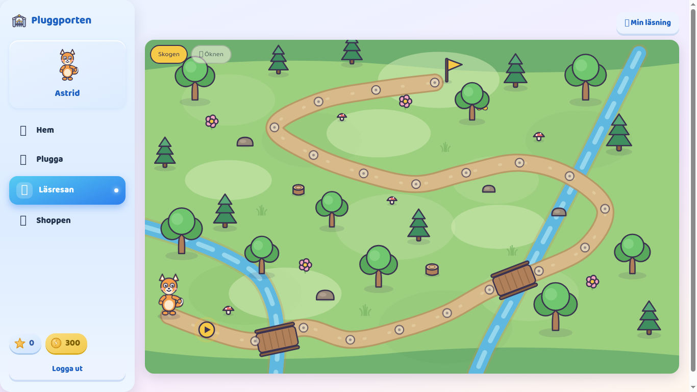 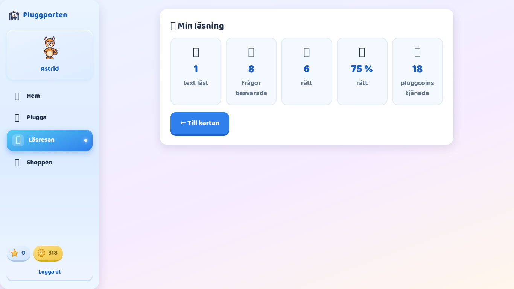 |
| 2 | 6/8 → 75 %, +18 kr, texten registrerad, highStreak 1, tillbaka till kartan, exakt ett steg | **PASS** | UI med `lr-n3-oknar` (8 frågor). Sammanfattning "6 av 8 rätt, +18", saldo 300 → **318** i sidomenyn. Emulatorn: `coins 318`, försök `{correct:6,total:8,percentage:75,earnedMoney:18}`, `seenTextIds:["lr-n3-oknar"]`, `highStreak:1`, `level:3`, `stepInWorld:1`. "Gå vidare" → kartan: avataren animeras (296,535)→(369,562) och stannar. Steg 1 klart, steg 2 nästa, övriga låsta.   |
| 3 | 75/80/71 % → nivå 3→4, eleven informeras inte | **PASS** | Brygga, `qa-hog`: 6/8 = 75 % → hs 1, 4/5 = 80 % → hs 2, 5/7 = 71 % → **nivå 4**, hs 0. Även i UI (`qa-hog` med hs 2, 7/7 på `lr-n3-flyta-sjunka`): nivå 3 → 4, men sammanfattningen visar bara "Alla rätt! 7 av 7 rätt +21 Gå vidare". Ingen nivåtext. 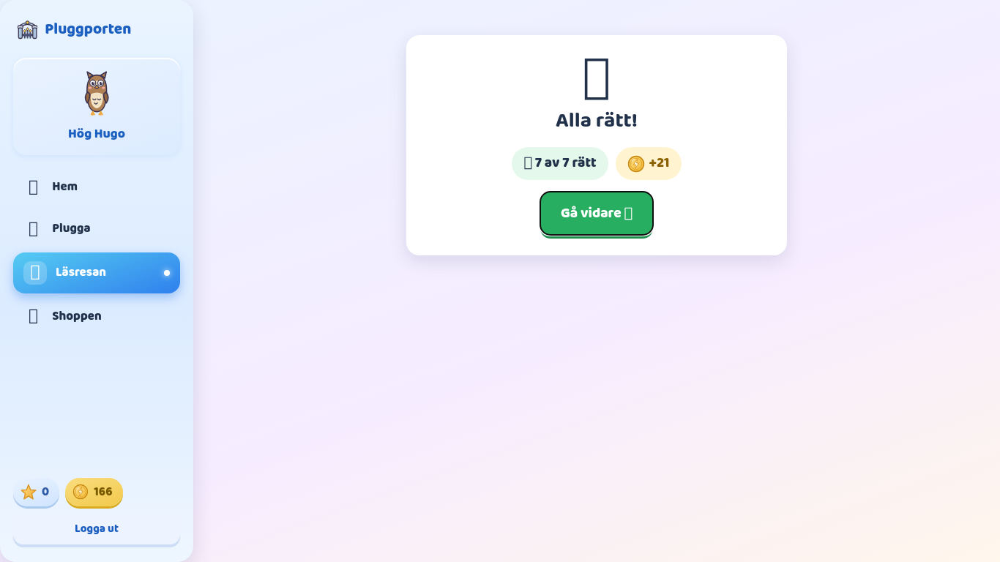 |
| 4 | 80/76/65 % → ingen ändring, highStreak nollad | **PASS** | Brygga, `qa-mitt`: 4/5 = 80 % → hs 1, 7/9 = 78 % → hs 2, 5/8 = 63 % → nivå **3**, hs **0**, ls 0. (76 och 65 går inte att nå exakt, se ovan.) |
| 5 | 43/49 % → nivå −1 | **PASS** | Brygga, `qa-lag`: 3/7 = 43 % → ls 1, 4/9 = 44 % → **nivå 2**, ls 0. |
| 6 | Exakt 50 % → inte lowStreak | **PASS** | Brygga, `qa-femtio` seedad med `lowStreak:1`: 4/8 = 50 % → ls **0**, nivå 3 (en låg text hade gett nivå 2). |
| 7 | 19 texter + text 20 → sista steget, Skogen klar, Öknen öppen, nästa text i Öknen, nivån oförändrad | **PASS** | UI, `qa-skogen19` (seed: steg 19, nivå 4, hs 1): "Spela steg 20" → `lr-n4-bina` 5/8. Sammanfattningen: "🏆 Skogen är klar! Nu väntar Öknen." Kartan: avataren går till flaggan, 20 klara steg, "Skogen är klar! 🔓 Öknen öppnas!" och knappen "Vidare till Öknen →". Sedan Öknen-kartan med steg 1 som nästa. Nästa text `lr-n4-orienteringen` startas i Öknen. Emulatorn: `worldId:"oknen"`, `stepInWorld:0`, `completedWorlds:["skogen"]`, **nivå 4 (oförändrad)**. 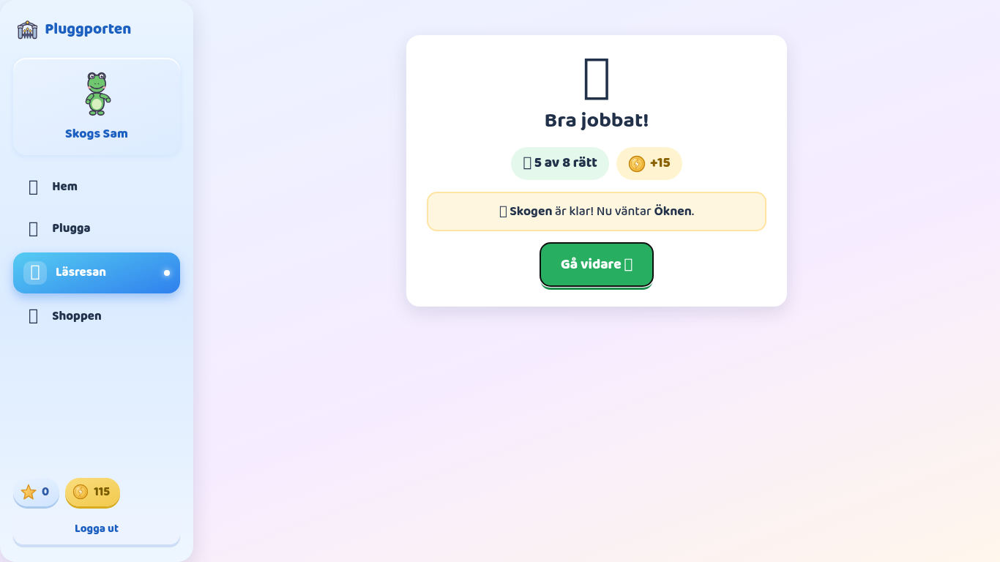 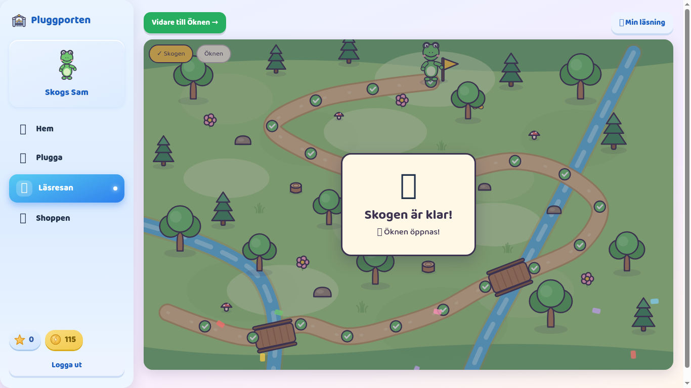 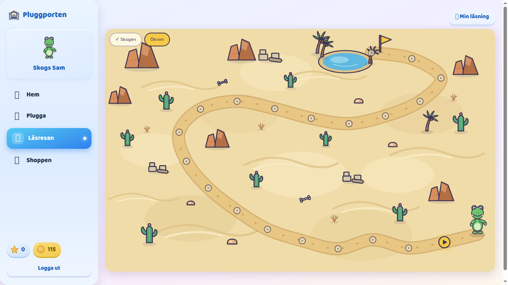 |
| 8 | 4 rätt av 7 → exakt +12 kr | **PASS** | UI, elev1 med `lr-n3-skolfotot` (7 frågor): "4 av 7 rätt +12", saldo 318 → **330**. Emulatorn: `earnedMoney:12`, `moneyEarned` 18 → 30. 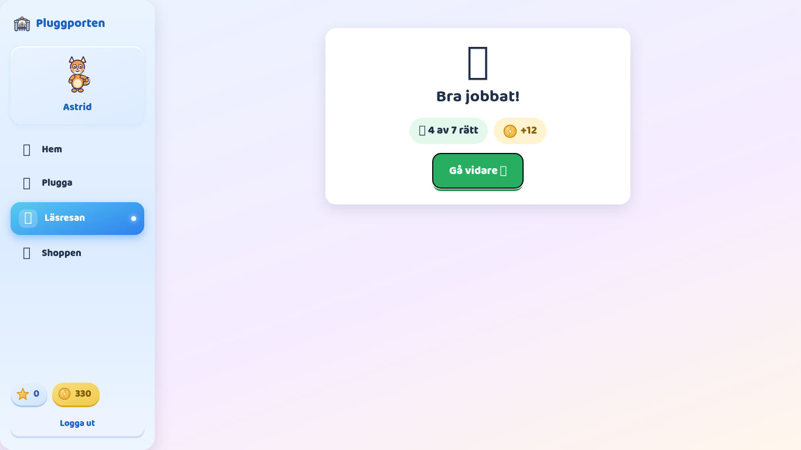 |
| 9 | Flera olästa på nivån → ingen redan läst väljs | **PASS** | `qa-olast` har läst 3 av 6 nivå-3-texter. 500 `pickText`-dragningar mot den riktiga banken (42 texter) gav bara de 3 olästa (163/160/177). Det riktiga flödet (`nextTextFor` → `startText` → `completeText`) tre gånger i rad valde `oknar`, `flyta-sjunka` och `vikingaskepp`, alla olästa. Även `qa-hog` i UI fick en oläst text. |
| 10 | Läraren: alla elever i en tabell, korrekt statistik, sortering, elevdetalj per frågetyp | **PASS** | `qalarare` → QA-klass 4A → Statistik → Läsresan: 10 rader, "9 av 10 elever har börjat · 65 lästa texter · 72 % rätt". Alla rader stämmer mot emulatorn (t.ex. Astrid 2/15/10/5/67 %/3/Skogen 2/20, Skogs Sam 20/148/105/43/71 %/4/Öknen 0/20). Ny Nora visas som "ej börjat" med –. Namnet `Bo <b>Svag</b>` visas som text (escapat). Sortering: Rätt % fallande/stigande (– sist), Läsnivå, Texter och Namn (sv) fungerar, och Värld fallande ger Öknen 2, Öknen 0, Skogen 6 … (`aria-sort` uppdateras). Elevdetaljen för Astrid: per frågetyp Fakta 2/5, Ordförståelse 3/4, Mellan raderna 3/4, Helhet 2/2, vilket är exakt summan av hennes två försök. Senaste texterna Skolfotot 4/7 och Öknar 6/8. Ny Nora: tomt läge. 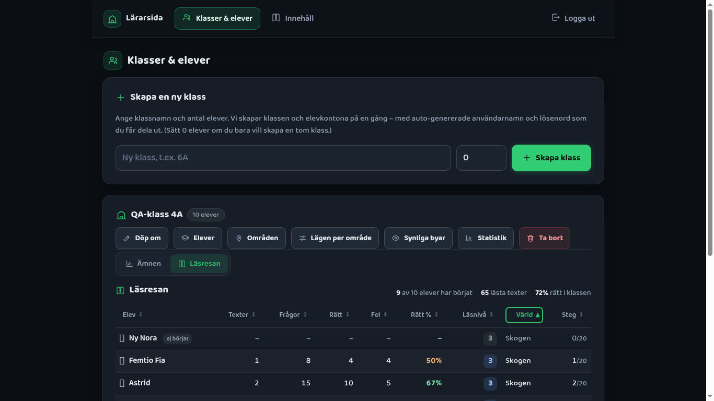 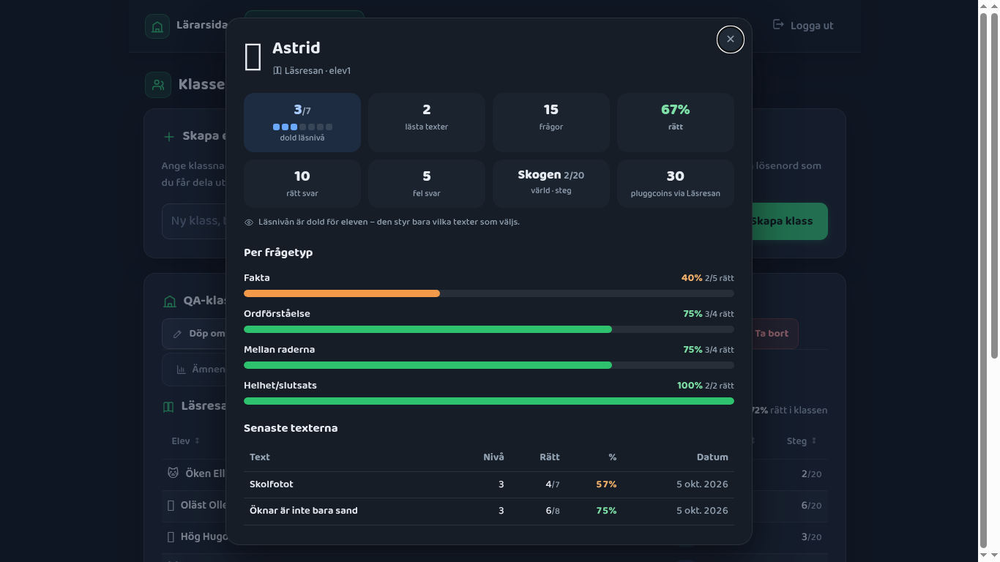 |

---

## Extra kontroller

| Kontroll | Resultat | Bevis |
| --- | --- | --- |
| Texten står kvar medan eleven svarar, Chromebook 1366×768 | **PASS** | Text och fråga sida vid sida. Texten är `position: sticky` med egen scroll. Se F3 (kosmetiskt). 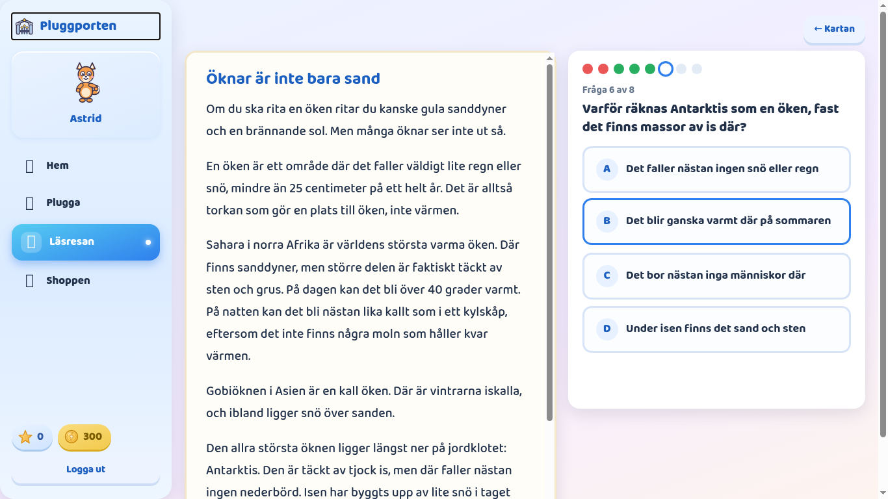 |
| … desktop 1920×1080 | **PASS** | 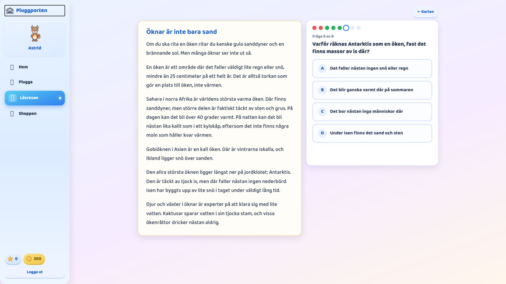 |
| … surfplatta 820×1180 | **PASS** | Texten i en scrollruta överst (126–622 px) och frågan under. Alla 4 knappar syns utan scroll. 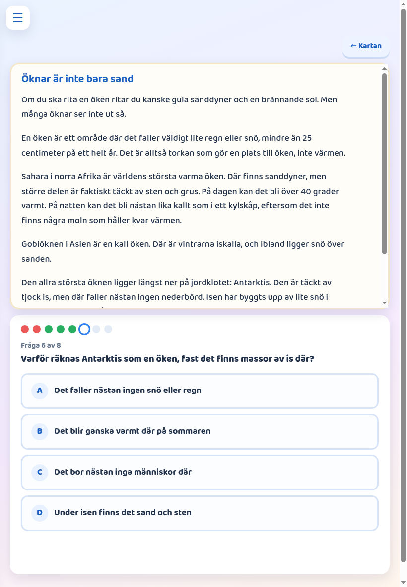 |
| Svaret låses vid dubbelklick | **PASS** | Riktigt dubbelklick (CDP) på ett alternativ: **ett** svar registreras, alla 4 knappar `disabled`, "❌ Fel". |
| Svaret låses för tangentbordet | **PASS** | Fokus på ett alternativ + Enter → svaret registreras. Sedan Tab + Enter + mellanslag: svaret ändras inte (låsta knappar går inte att fokusera, så Tab hoppar ut ur frågan). Antalet svar var oförändrat. |
| En fråga i taget | **PASS** | "Fråga N av M", en fråga renderas, prickraden visar läget. |
| Avbruten text → samma text när man kommer tillbaka | **PASS** | Efter 5 svar: navigering till Hem och tillbaka gav samma text, fråga 6, och de 5 låsta svaren följde med (prickar fel, fel, rätt, rätt, rätt). Efter **hel sidomladdning** efter 1 svar: samma text på fråga 2. |
| Dubbel inlämning (två samtidiga `completeText`) | **PASS** | En `ok:true` (+21) och en `ok:false, reason:"not-started"`. Saldot ökade bara en gång (176 → 197), +1 text, +1 steg. |

## Prod-läget: `lasresaAttempts`-regeln ej deployad

Main-grenens `firestore.rules` (utan subkollektionsregeln) laddades in i emulatorn via REST (`PUT …:securityRules`).
Därefter kördes en text som `qa-femtio`:

- `completeText` lyckades (`ok:true`, +18). Saldot blev 130, tillståndet uppdaterades, och försöket hamnade i
  `studentData.lasresaAttemptsFallback` (1 st).
- Konsolen visade det förväntade: `[Läsresan] lasresaAttempts nekades (regeln ej deployad?) – sparar försöket i studentData i stället.`
- `listAttempts` gav fallback-försöket (`fallback-0`) och en varning om den nekade subkollektionen. Ingen krasch.
- Grenens regler återställdes i emulatorn efteråt.

## Regression

| Område | Resultat | Bevis |
| --- | --- | --- |
| Inloggning, Hem (husvärlden), sidomeny | **PASS** | Formulärinloggning elev och lärare. Sidomenyn visar Hem/Plugga/Läsresan/Shoppen och saldot. |
| Plugga | **PASS** | Arbetsområdena (Vikingatiden, Talsorter) visas. Områdessidan listar alla lägen. |
| Läsuppdrag (`lastext`) och `readingLevel` | **PASS** | elev1 har `readingLevel: 2`. Läsuppdrag visar "Text 1 av 1 · Nivå 2" och kan lämnas in ("Bra jobbat! +16"). `readingLevel` är **2 före och efter** alla Läsresan-texter (Läsresans nivå är ett eget fält). 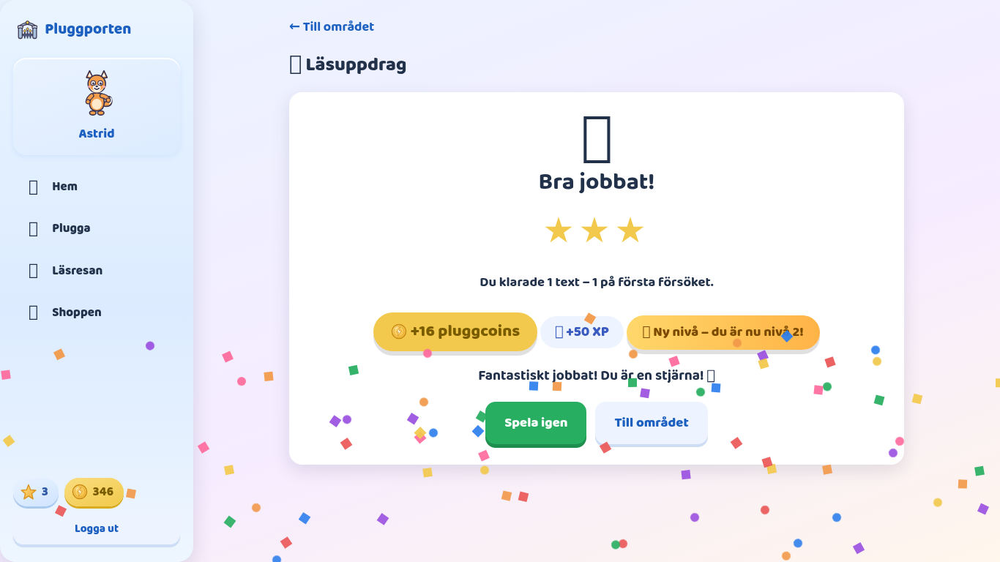 |
| Läsförståelse-läget (`lasforstaelse`) | **PASS** | Startar med "Fråga 1 av 5" och en kort text (`passage`) ovanför frågan, 4 alternativ. |
| Skattjakten | **PASS** | Intro och "Starta!" ger ön med båt, avatar och "🗺️ 0 / 10". 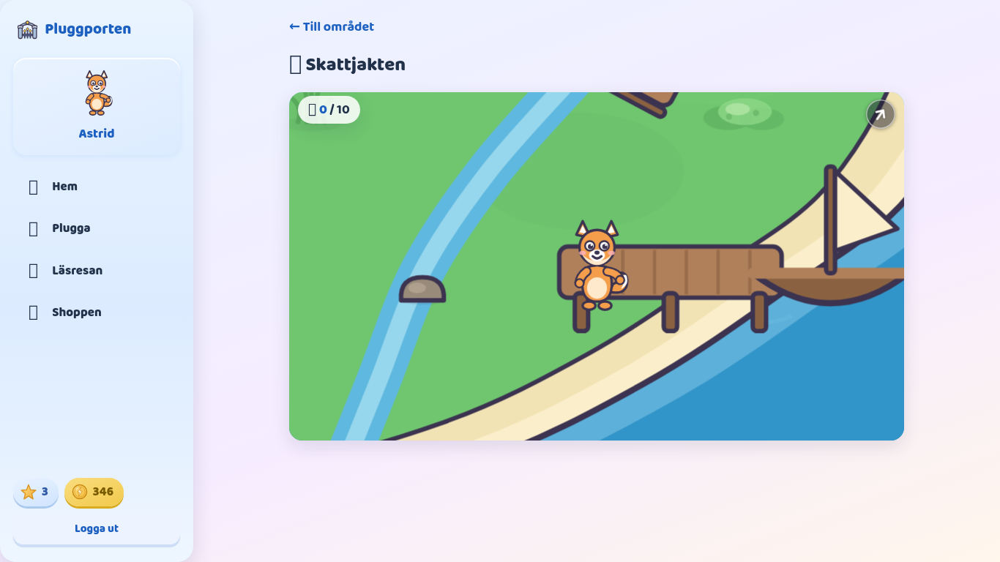 |
| Shoppen (saldot kan användas) | **PASS** | Saldo 346 (inklusive Läsresan-pengar). Köp av Krona (150) och Keps (20, köpt av misstag av mitt testskript) gav 176, alltså exakt 170 dragna. |
| Lärarsidan: Elever, Områden, Lägen per område, Synliga byar, Statistik/Ämnen, Innehåll | **PASS** | Alla öppnas utan felmeddelande. Ämnes-stjärnmatrisen renderas under fliken "Ämnen". Innehållsstudion laddar. Inga konsolfel. |
| Bootgraf | **PASS** | Egen BFS över statiska importer från `src/app.js`: gren = main = 133 filer, inga nya eller borttagna, ingen `lasresan`-fil. Läsresan laddas bara via `import()` (app.js:118 och teacher-class.js:85). Vaktas även av `test/lasresan-reader.test.js` och `test/lasresan-teacher.test.js`. |
| 400-raderstaket | **PASS** | Störst bland ändrade JS: `page-lasresan.js` 236, `ui-map.js` 229, `data-lasresan.js` 224. |

---

## Fynd

Inga blockerande buggar. Ingenting är fixat i appkoden.

**F1: Integritet: den dolda nivån och fallback-försöken kan läsas av klasskamrater** (medel, beslut för leaden)
Regeln `studentData` tillåter läsning för alla inloggade så länge `husLast != true` (kompis-hus, f33092b, finns redan på main).
Därför kan en elev med devtools läsa en klasskamrats `studentData.lasresa.level` (och sin egen). Tills
`lasresaAttempts`-regeln är deployad hamnar dessutom försöken med resultat per fråga i
`studentData.lasresaAttemptsFallback`, som har samma öppna läsning. Subkollektionsregeln skrevs uttryckligen
"striktare (inga klasskamrater)".
*Repro:* som elev A, `getDoc(doc(db,"studentData","<elev B>"))` → `data().lasresa.level` och `lasresaAttemptsFallback`.
*Förslag:* deploya `firestore:rules` innan Läsresan används på riktigt, så att fallbacken inte fylls. Om nivån måste
vara hemlig även tekniskt behöver `lasresa.level` flyttas till ett eget dokument med strikt regel (en större ändring).

**F2: Innehållsvolym: upprepningar efter 6 texter på samma nivå** (låg, innehåll)
Banken har 6 texter per nivå, och en värld har 20 steg. En elev som ligger stilla på en nivå får redan lästa texter
från text 7 (picker.js följer spec §11: först olästa på nivån, sedan lästa, aldrig samma som förra gången). Det är
ingen bugg, men det märks i praktiken. *Förslag:* fortsätt fylla banken (uppföljning till #404), eller spec-beslut om
att ta olästa texter från närmaste nivå före en upprepning.

**F3: Läsvyn vid 1366×768: textrutan går 30 px under skärmkanten** (låg, kosmetiskt)
Verktygsraden ("← Kartan") ligger ovanför, så textrutan (`max-height: calc(100vh - 48px)`) börjar på y=78 och slutar
på y=798, och sidan scrollar 90 px. När man scrollar fäster `sticky` rutan helt i bild. *Förslag:* räkna in
verktygsradens höjd i `max-height` (`src/lasresan/lasresan.css:54`).

**F4: Två "Läsnivå" på lärarsidan** (info, UX)
Panelen *Elever* har "📖 Läsnivå" 1–3 (Läsuppdragens `readingLevel`), och fliken *Läsresan* har "Läsnivå" 1–7
(dold). De är olika saker med samma namn. *Förslag:* döp om en av dem, t.ex. "Läsresan-nivå".

**F5: Fanns redan: `test/e2e-auth.test.mjs` "elev1 … ser BARA sin egen data" faller** (info, inte Läsresan)
Testet förväntar sig att elev1 inte kan läsa elev2:s `studentData`, men regeln tillåter det sedan kompis-hus
(f33092b). Testfilen och läsregeln är identiska med main, så felet finns redan där. Det är samma rotorsak som F1.
Testet bör uppdateras (eller regeln ses över) i en separat issue.

*Miljö, ingen bugg:* emoji-glyfer saknas i headless-Chrome (fyrkanter i skärmdumparna), eftersom typsnittet saknas i
sandlådan.

---

## Köra om QA:n

```bash
# Java 21 krävs för emulatorn (JAVA_HOME/PATH)
firebase emulators:start --only auth,firestore --project pluggportalen-so-2026 &
export FIRESTORE_EMULATOR_HOST=127.0.0.1:8080 FIREBASE_AUTH_EMULATOR_HOST=127.0.0.1:9099 GCLOUD_PROJECT=pluggportalen-so-2026
node seed/seed.mjs && node admin/qa-lasresan-seed.mjs     # idempotent, återställer scenarierna
PORT=8000 node admin/qa-emulator-server.mjs               # appen mot emulatorn
# Hela testsviten (inkl. regel- och e2e-tester) i en ren emulator:
firebase emulators:exec --only auth,firestore --project pluggportalen-so-2026 "node --test"
```

Konton (emulator): elever `elev1`, `qa-hog`, `qa-mitt`, `qa-lag`, `qa-femtio`, `qa-skogen19`, `qa-olast`, `qa-oken`,
`qa-svag`, `qa-ny` och läraren `qalarare`. Alla har lösenordet `lilla123`.
