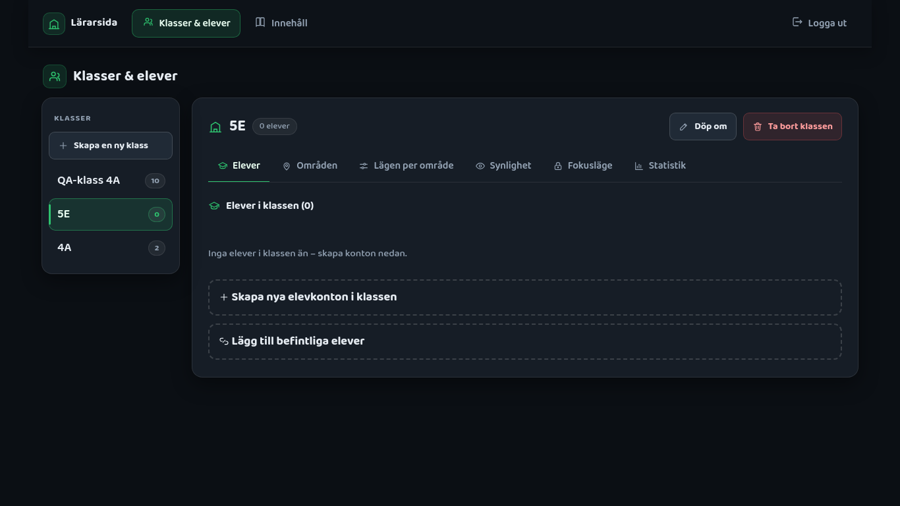
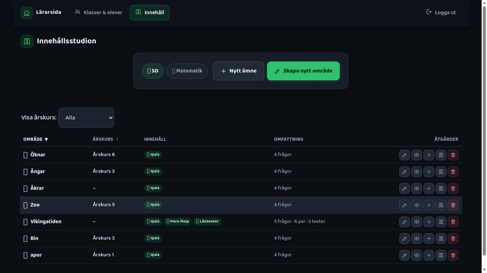
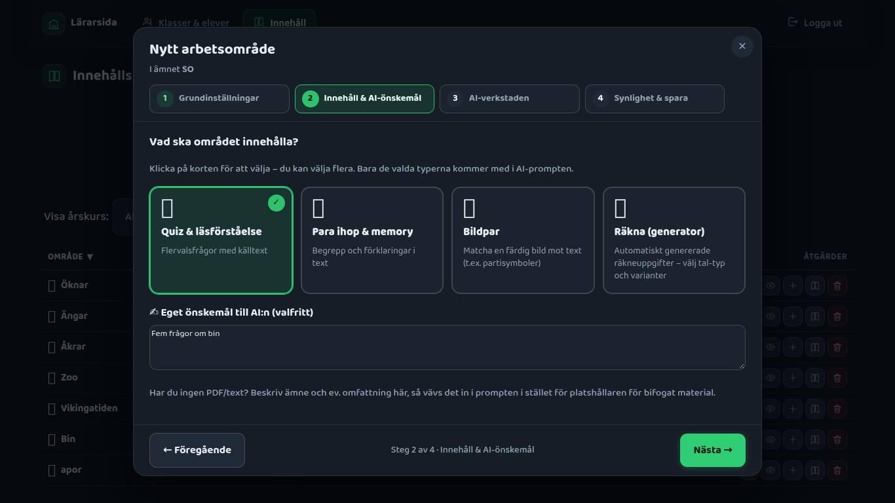
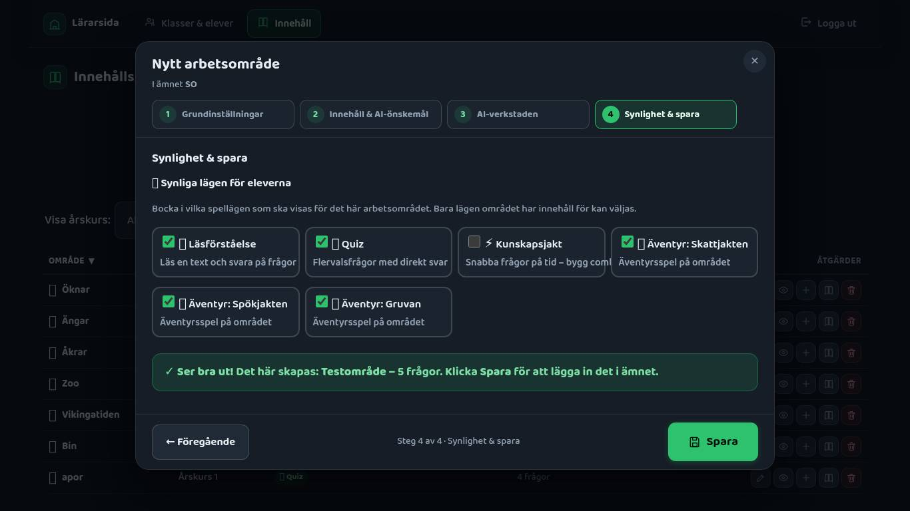
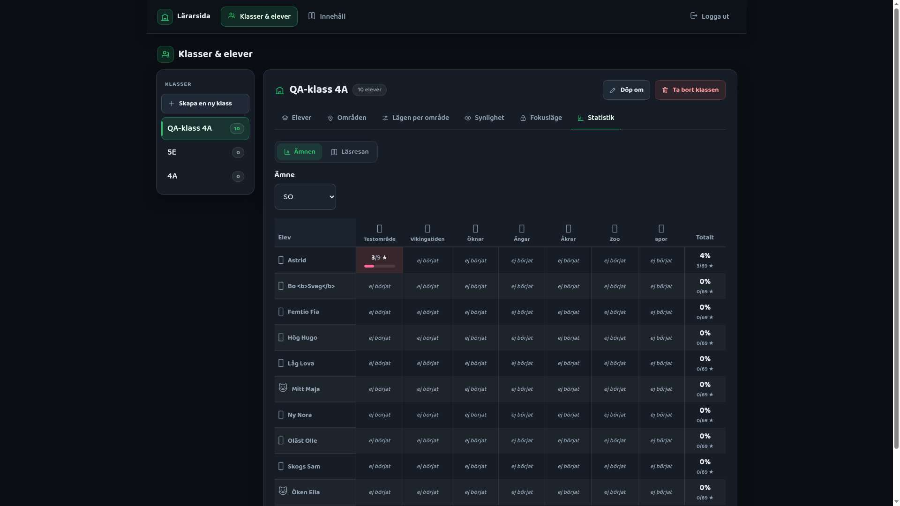
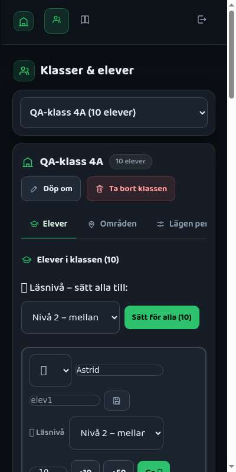
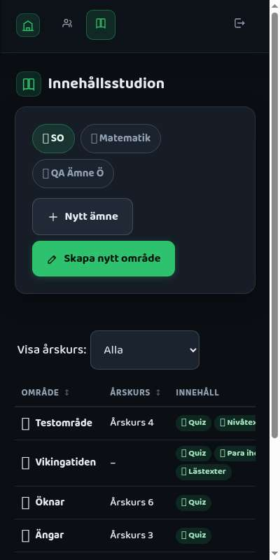

# Lärarsidans UX-revamp – funktionsinventering, state-analys & komponentplan

> **Issue #439** (Revamp 1/5) i **epic #438**. Läst från `main` @ `8c83cf4` (efter #436 klass-lås).
> Ingen UI-kod ändras här. Dokumentet är **kontraktet** för #440 (Master-Detail + skal),
> #441 (innehållstabell), #442 (wizard) och #443 (QA).

## 0. Så används dokumentet

- **Varje rad har ett ID** (`R-`, `N-`, `K-`, `E-` …). Coders bockar av sina rader i PR/sign-off
  ("K-01–K-17 ✔"). QA (#443) fyller i kolumnen **QA** med ✅/❌ + kommentar direkt i den här filen.
- **Ny plats** anger var funktionen hamnar i nya designen:

| Kod | Betyder |
|---|---|
| `SKAL` | Lärarskalet: toppnav som byggs ur en flik-registry (Del 6, #440) |
| `M` | Master-listan (vänstermenyn i klassvyn, #440) |
| `D-huvud` | Detaljytans huvud – klassnamn + åtgärder för hela klassen (#440) |
| `D:Elever` / `D:Områden` / `D:Lägen` / `D:Synlighet` / `D:Fokus` / `D:Statistik` | Sektion (flik) i detaljytan, byggd ur sektions-registryn (#440) |
| `TAB` | Innehållstabellen på #/larare/innehall (#441) |
| `WZ1`–`WZ4` | Wizard-steg 1–4 (#442) |
| `WZ-motor` | Wizardens stegmotor/skal (modal, stegindikator, Föregående/Nästa, stäng) |
| `OFÖR` | Oförändrad – samma komponent och beteende (ev. ny omgivning) |

- **Logikkolumnen** (fil → funktion → data-anrop) är det reviewers diffar mot: anropet ska finnas
  kvar och vara oförändrat.
- `🆕` = ny beteendeförändring som epicen *kräver* (inte en befintlig funktion).

---

## 1. Funktionsinventering

### 1.1 Routes, redirects och lärarspärr (`src/app.js`, `teacher.js`, `teacher-shared.js`)

| ID | Funktion | Vad den gör | Fil → funktion | Ny plats | QA |
|---|---|---|---|---|---|
| R-01 | `#/larare` | Redirect → `#/larare/klasser` (översiktshubben borttagen #304) | app.js `routes["/larare"]` | OFÖR | ✅ → `#/larare/klasser` (+ senast valda klass) |
| R-02 | `#/larare/klass` | Redirect → `#/larare/klasser` (gamla statistikfliken, #299) | app.js | OFÖR | ✅ → `#/larare/klasser` |
| R-03 | `#/larare/elever` | Redirect → `#/larare/klasser` | app.js | OFÖR | ✅ → `#/larare/klasser` |
| R-04 | `#/larare/prompter` | Redirect → `#/larare/innehall` (#62) | app.js | OFÖR | ✅ → `#/larare/innehall` |
| R-05 | `#/larare/klasser` | Klasser, elevkonton & statistik (enad sida) | app.js → `pageLarareKlasser(teacherCtx)` (teacher-classes.js) | `SKAL` + Master-Detail. 🆕 valfri query `?klass=<id>&sektion=<key>` (se §2.4) | ✅ Master-Detail. Djuplänk `?klass=4a&sektion=fokus` återställer klass+sektion; okänd `?klass=` → senast valda (sessionStorage), okänd sektion → Elever |
| R-06 | `#/larare/innehall` | Innehållsstudion | app.js → `pageLarareInnehall(teacherCtx)` (teacher-content.js) | `SKAL` + `TAB` | ✅ Skal + tabell |
| R-07 | `body.larare-lage` | Router håller mörk body-bakgrund under hela lärarvistelsen (inget vitt blänk vid flikbyte) | app.js `router()` | OFÖR | ✅ `body.larare-lage` satt på båda flikarna och i spärren |
| R-08 | Ingen elev-sidomeny på lärarsidor | `renderTopbar()` fäller ihop elevmenyn utanför `/elev/` | ui.js `renderTopbar` | OFÖR | ✅ `#sidebar` är `display:none` på lärarsidor |
| R-09 | Lärarspärr – formulär | Användarnamn + lösenord + "Logga in" (Firebase Auth, claim `teacher:true`), "Loggar in…", felruta | teacher-shared.js `renderGate` → auth.js `signInTeacher` | OFÖR | ✅ Fel lösen → "Fel användarnamn eller lösenord. Försök igen."; rätt lösen → in |
| R-10 | Lärarspärr – "← Tillbaka" | Till porten `#/` | `renderGate` | OFÖR | ✅ "← Tillbaka" visas i spärren (inte klickad) |
| R-11 | Efter inloggning | Landar på `#/larare/klasser`; om hashen redan matchar dispatchas en syntetisk `hashchange` | `renderGate` | OFÖR (⚠️ se risk X-09 om `?klass=`) | ✅ Landar på `#/larare/klasser`. X-09 som förväntat: sektionen i URL:en tappas efter inloggning via spärren, klassen minns (sessionStorage) |
| R-12 | Behörighetskoll per sida | `isTeacher()` → annars `renderGate` | `pageLarareKlasser`, `pageLarareInnehall` | OFÖR (måste finnas kvar i de nya sid-skalen) | ✅ Spärren visas för utloggad (även efter omladdning) på båda sidorna |

### 1.2 Lärarskalet (`teacher-shared.js`)

| ID | Funktion | Vad den gör | Fil → funktion | Ny plats | QA |
|---|---|---|---|---|---|
| N-01 | Varumärke "Lärarsida" + skol-ikon | Vänster i toppnaven | `teacherNav` | `SKAL` | ✅ |
| N-02 | Flik "Klasser & elever" | `go("#/larare/klasser")` | `teacherNav` (hårdkodad `tabs`-array) | `SKAL` – rad i flik-registryn | ✅ |
| N-03 | Flik "Innehåll" | `go("#/larare/innehall")` | `teacherNav` | `SKAL` – rad i flik-registryn | ✅ |
| N-04 | Aktiv flik | `.active` + `aria-current="page"` | `teacherNav(ctx, active)` | `SKAL` | ✅ `.active` + `aria-current="page"` på rätt flik |
| N-05 | "Logga ut" | `setTeacher(false)` → `signOutCurrent()`, sedan `go("#/")` | `teacherNav` | `SKAL` (fast, utanför registryn) | ✅ Loggar ut → `#/` (porten) |
| N-06 | Sidtitel | "Klasser & elever" / "Innehållsstudion" med linje-ikon | `teacherHead` | `SKAL` (kan tas från registry-radens `label`/`icon`) | ✅ "Klasser & elever" / "Innehållsstudion" med ikon |
| N-07 | Tomtillstånd | Ikon + rubrik + text + ev. knapp med `data-hash` | `emptyState` | OFÖR (återanvänds överallt) | ✅ T.ex. tomt ämne ("Inga arbetsområden i ämnet ännu") och Läsresan-tomt |
| N-08 | Linje-ikoner | `icon(name, size)` – 26 ikoner, currentColor | `icon` / `ICONS` | OFÖR (lägg till ikoner vid behov) | ✅ Linje-ikoner OK. (Emojis visas som rutor i headless-Chrome – saknad font i testmiljön, inte appen) |
| N-09 | Kopiera till urklipp | `copyText(text, btn)` → "✓ Kopierat!" 1,6 s, fallback `execCommand` | `copyText` | OFÖR | ✅ "✓ Kopierat!" (Kopiera alla, AI-prompt i wizard och nivåtexter) |
| N-10 | Interna länkar | `wireHashLinks` kopplar `[data-hash]` till `ctx.go` | `wireHashLinks` | OFÖR | ⚪ Ej körd – kräver tomt bibliotek (O-04/L-05-knappen). Koden är oförändrad |

### 1.3 Klasser – sidnivå & skapa klass (`teacher-classes.js`)

| ID | Funktion | Vad den gör | Fil → funktion → data | Ny plats | QA |
|---|---|---|---|---|---|
| K-01 | Initial laddning | Spinner "Laddar klasser…", `getClasses()` + `getStudents()` parallellt, felruta vid fel; elever sorteras på namn (sv) | `pageLarareKlasser` | Sid-skal/store (#440) | ✅ Spinner "Laddar klasser…", sedan Master-Detail |
| K-02 | "Skapa en ny klass" – klassnamn | Textfält | `#new-name` | `M` → knapp "+ Skapa en ny klass" som öppnar formuläret i detaljytan (eller modal) | ✅ "+ Skapa en ny klass" → detaljytans ny-läge (D-4) |
| K-03 | Antal elever | number 0–40, default 0 | `#new-count` | samma som K-02 | ✅ Default 0 |
| K-04 | "Skapa klass" | id = `slugify(namn)` (fallback `klass-<ts>`), dubblettkoll på id, `order` = max+1 → `data.upsertClass(id,{name,order})` | `#new-form submit` | samma som K-02; 🆕 nya klassen väljs automatiskt i `M` | ✅ id = slug (`5e`, `4a`, `qa-tom`), `order` = max+1; 🆕 nya klassen väljs automatiskt |
| K-05 | Valideringsfel | "Skriv ett namn…", "Det finns redan en klass som heter…", "Kunde inte skapa klassen…" | `#new-msg` | samma som K-02 | ✅ "Skriv ett namn…" och "Det finns redan en klass som heter "5E"". (Skrivfel-grenen inte provocerad) |
| K-06 | 0 elever | "✓ Klassen skapades. Klicka **Elever**…" | `#new-form submit` | samma; texten pekar på `D:Elever` | ✅ Flash "✓ Klassen "5E" skapades. Lägg till elever nedan." + Elever-sektionen |
| K-07 | N elever → kontoeditor | `renderAccountEditor` med `usernamePrefix(namn)` och alla befintliga användarnamn som upptagna | `#new-form submit` → teacher-login-cards.js | `D:Elever` för nya klassen (se A-xx) | ✅ Kontoeditor med `4a01`/`4a02` och prefix-förslag |
| K-08 | Konton skapade | push till `state.students`, `data.setClassStudents(id, ids)` (fel → "klasskopplingen misslyckades"), rita om, credentials-panel | `onCreated` | `D:Elever` + credentials (C-xx) | ✅ Konton → `setClassStudents` → landar på Elever med lösenordspanel. (Felgrenen "klasskopplingen misslyckades" inte provocerad) |
| K-09 | Tomtillstånd | "Inga klasser än" | `renderClasses` | `M` (tom lista + uppmaning) och tom `D` | ✅ "Inga klasser än" i master + skapa-läge i detaljen. Nit: URL:en behåller `?klass=<borttagen>` (ofarligt) |
| K-10 | Klassordning | Sorterat på `order`, sedan namn (sv) | `renderClasses` | `M` | ✅ Sorterat på `order` |
| K-11 | Klassrad: namn + antal elever | `.class-name` + `.class-count` ("N elever") | `classCard` | `M` (namn + antal) och `D-huvud` | ✅ Namn + antal i master och i detaljhuvudet |
| K-12 | Döp om | `prompt()` → `data.upsertClass(id,{name})`, uppdaterar namnet på kortet, `alert` vid fel | `classCard [data-act=rename]` | `D-huvud`; 🆕 namnet i `M` uppdateras också | ✅ prompt → namnet uppdateras i huvudet OCH i master (🆕) |
| K-13 | Ta bort klass | `confirm` ("Elevkontona finns kvar…") → `data.deleteClass(id)` → rita om | `classCard [data-act=del]` | `D-huvud` (danger); 🆕 efter borttag väljs nästa klass i `M` | ✅ confirm → nästa klass väljs (5E→4A), sista → föregående (4A→QA-klass) |
| K-14 | En panel åt gången | Klick öppnar en sektion och stänger övriga; klick på öppen fäller ihop | `togglePanel` | Ersätts av sektionsflikar i `D` (alltid exakt en sektion synlig) | ✅ Sektionsflikar, alltid exakt en sektion; vald sektion behålls vid klassbyte |
| K-15 | Biblioteks-cache | `loadLibrary()`: `getSubjects()` + `getAreas()` per ämne, ämnen utan områden bort; cachas för sidan, delas av Områden/Lägen/Fokus/Statistik | `loadLibrary` | Store (#440) – en gång per sidbesök, delad av alla klasser | ✅ Biblioteket delas: klassbyte gör 0 läsningar av `classes`/`students`/bibliotek (räknat i stubben `__ppStub`) |
| K-16 | Laddningsfel i panel | "Kunde inte ladda arbetsområden/områden/byar/moduler/fokusläge/ämnen: …" | `lazyPanel` + Områden/Lägen/Statistik-hanterare | Sektions-värden i `D` (samma felmönster) | ⚪ Laddningsfel inte provocerat (koden `withLoading` granskad) |
| K-17 | Lazy-laddade paneler | Byar, Moduler, Fokusläge laddas via dynamisk `import()` (bootgraf-skydd #271) | `lazyPanel` | `D` – sektions-registryn har `load: () => import(...)` | ✅ Synlighet (moduler+byar), Fokusläge och Läsresan laddas med `import()` |

### 1.4 Klass → Elever (medlemshanteraren, `teacher-class-accounts.js` `renderMemberManager`)

| ID | Funktion | Vad den gör | Fil → funktion → data | Ny plats | QA |
|---|---|---|---|---|---|
| E-01 | Rubrik "Elever i klassen (N)" | Medlemmar sorterade på namn | `draw` | `D:Elever` | ✅ "Elever i klassen (N)" |
| E-02 | Avatar-väljare per elev | `<select>` med alla `AVATARS` | `memberRow` / `avatarSelectHtml` | `D:Elever` | ✅ Avatar sparas (katt) |
| E-03 | Namn per elev | Redigerbart fält | `memberRow .mm-namn` | `D:Elever` | ✅ |
| E-04 | Användarnamn | Visas, `disabled` ("kan inte ändras") | `memberRow .mm-username` | `D:Elever` | ✅ disabled + title "Användarnamn kan inte ändras" |
| E-05 | Spara namn/avatar | 💾 → `data.upsertStudent(id,{namn,avatarId})`, "✓ Sparat"/"Namn saknas"/fel | `memberRow .mm-save` | `D:Elever` | ✅ "✓ Sparat" |
| E-06 | Läsnivå per elev | `<select>` nivå 1–3, autosparar `data.setReadingLevel(level,id)`, "✓ Nivå N"; batch-laddas via `getReadingLevel` | teacher-student-level.js `mountMemberLevels` | `D:Elever` | ✅ Autosparar "✓ Nivå 3" |
| E-07 | Läsnivå – "Sätt för alla (N)" | Sätter vald nivå för alla medlemmar parallellt, speglar i varje väljare, "Sparade x/N…" vid delfel | `mountMemberLevels` (bulk) | `D:Elever` | ✅ "✓ Satte nivå 1 för 2 elever." + varje väljare speglas |
| E-08 | Ge 🪙 – belopp | number ≥1, default 10 | `memberRow .gc-amount` | `D:Elever` | ✅ Default 10 |
| E-09 | Ge 🪙 – snabbval +10 / +50 | Sätter beloppet | `wireGiveCoins .gc-quick` | `D:Elever` | ✅ +10/+50 |
| E-10 | "Ge 🪙" | `data.addCoins(n,id)` → `data.getCoins(id)` → "✓ X fick N 🪙 – nytt saldo: M 🪙"; fel/"Skriv ett antal" | `wireGiveCoins .gc-give` | `D:Elever` | ✅ "✓ Testa Testsson fick 10 🪙 – nytt saldo: 60 🪙", tomt fält → "Skriv ett antal". ⚠️ Förekommande sedan tidigare: samtidigt med en nivå-sparning visades "nytt saldo: 0" fast DB hade 50 (cache-race i data.js, inte epicen) |
| E-11 | Ta ur klassen | `data.setClassStudents(cls.id, utan elev)`, räknare + lista ritas om | `memberRow [data-act=unlink]` | `D:Elever`; 🆕 antalet i `M` uppdateras | ✅ 🆕 Antalet i master + huvud uppdateras direkt |
| E-12 | Ta bort konto | `confirm` ("…speldata… går inte att ångra") → `data.deleteStudent(id)` + `setClassStudents` | `memberRow [data-act=del]` | `D:Elever`; 🆕 antalet i `M` uppdateras | ✅ confirm → borttagen, antal uppdateras. ⚠️ Förekommande sedan tidigare: ett zombie-dokument `students/{id}` = `{classIds:[]}` blir kvar, och Auth-kontot finns kvar (se P2) |
| E-13 | Tomt | "Inga elever i klassen än – skapa konton nedan." | `draw` | `D:Elever` | ✅ "Inga elever i klassen än – skapa konton nedan." |
| E-14 | "Skapa nya elevkonton i klassen" | `
`: antal 1–40 (default 5), prefix-hint `<prefix>NN`, "Förbered konton" (fel "Ange ett antal") | `draw .mm-create` | `D:Elever` | ✅ Default 5, hint `4aNN`, "Förbered konton" |
| E-15 | → kontoeditor → skapade | `renderAccountEditor` → `setClassStudents([...gamla, ...nya])` → credentials-panel ovanför listan | `draw` `onCreated` | `D:Elever` (⚠️ risk X-08) | ✅ Lösenordspanelen ovanför listan. X-08: panelen ligger kvar vid klassbyte tills "Stäng – jag har sparat lösenorden" |
| E-16 | "Lägg till befintliga elever" | `
`: kryssrutor för elever som inte är medlemmar + "Lägg till valda" → `setClassStudents`; "Kryssa i minst en elev"; "Alla elevkonton finns redan i den här klassen." | `draw .mm-link` | `D:Elever` | ✅ "Kryssa i minst en elev." + lägger till vald elev |
| E-17 | Live-räknare | Klasskortets "N elever" uppdateras vid varje ändring | `updateCount` / `countEl` | `M` + `D-huvud` | ✅ Master + detaljhuvud |

### 1.5 Kontoeditor, credentials-panel och inloggningskort (`teacher-login-cards.js`, `teacher-class-accounts.js`)

| ID | Funktion | Vad den gör | Fil → funktion → data | Ny plats | QA |
|---|---|---|---|---|---|
| A-01 | Redigerbar kontotabell | Namn / användarnamn / lösenord förifyllt (`buildAccountPlan`: `<prefix>NN` + ord+3 siffror) | `renderAccountEditor` | OFÖR (monteras i `D:Elever` resp. skapa-klass-flödet) | ✅ |
| A-02 | 🔀 per rad | Nytt förslag för raden; namnet följer med om läraren inte rört det | `regenRow` | OFÖR | ✅ 🔀 nytt förslag för raden |
| A-03 | "Generera alla" | Nya förslag för alla rader | `.ae-gen-all` | OFÖR | ✅ "Generera alla" |
| A-04 | Validering | Format `^[a-z0-9._-]{3,}$`, dubbletter i listan, lösen ≥6, `data.usernameTaken` (async); felrad under raden | `validate` | OFÖR | ✅ Formatfel visas. ⚠️ Förekommande sedan tidigare: `usernameTaken` missar användarnamn vars konto bara finns kvar i Auth → fel först vid Skapa (P2/P3) |
| A-05 | "Skapa N konton" | `createAccountsFromEntries` → `data.upsertStudent(null,…)` (sekundär Firebase-app), progress "Skapar konton… i/N", vid delfel behålls skapade (`err.created`) | `.ae-create` | OFÖR | ✅ Skapar, progress, landar med lösenordspanel |
| A-06 | "Avbryt" | Stänger editorn | `.ae-cancel` | OFÖR | ✅ Avbryt stänger editorn |
| C-01 | Credentials-panel | "⚠️ N konton skapade – kopiera/skriv ner lösenorden **nu**", tabell namn/användarnamn/lösenord | `credentialsPanel` | `D:Elever` (och efter skapa klass) | ✅ "⚠️ N konton skapade…" + tabell |
| C-02 | "Kopiera alla" | Text `Klass X – inloggning…` + en rad per elev → `copyText` | `credentialsPanel .cred-copy` | OFÖR | ✅ "✓ Kopierat!" |
| C-03 | "Skriv ut inloggningskort" | Overlay (`.login-cards-overlay.teacher-dark`) med ett kort per elev; "Skriv ut" = `window.print()`, "Stäng", Esc; `@media print` | `printLoginCards` | OFÖR | ✅ Overlay `.login-cards-overlay.teacher-dark`, ett kort per elev, Esc stänger. (Skriv ut = `window.print` inte klickad i headless) |

### 1.6 Klass → Områden & Lägen per område (`teacher-class-modes.js`)

| ID | Funktion | Vad den gör | Fil → funktion → data | Ny plats | QA |
|---|---|---|---|---|---|
| O-01 | 📌 Områden – kryssrutor | Per ämne × område, förifyllt ur `cls.assignedAreas` | `renderClassAssignments` | `D:Områden` | ✅ Kryssrutor per ämne × område; isolerat per klass (4A ≠ 5E) |
| O-02 | "Spara områden" | `data.setClassAssignments(id, picked)` → "✓ Sparat (N områden)" / "eleverna ser allt" | `renderClassAssignments` | `D:Områden` | ✅ "✓ Sparat (1 område)" |
| O-03 | "Rensa (visa allt)" | Avbockar alla (spara krävs) | `renderClassAssignments` | `D:Områden` | ✅ Rensa avbockar allt |
| O-04 | Tomt bibliotek | emptyState "Inga arbetsområden än" + knapp → `#/larare/innehall` | `renderClassAssignments` | `D:Områden` | ⚪ Ej körd (biblioteket har områden). Kod oförändrad |
| L-01 | 🎮 Lägen per område | Relevanta områden (tilldelade, annars alla), per område kryssrutor för `availableGamemodes(area)`; förifyllt ur `classAreaHiddenModes` | `renderClassAreaModes` | `D:Lägen` | ✅ Per område × läge. Nit (fanns före epicen): hinttexten hänvisar till "klassens 🎮 Lägen ovan", som inte finns i UI:t |
| L-02 | Område utan lägen | "Inga spelbara lägen på området än." | `renderClassAreaModes` | `D:Lägen` | ⚪ Inget område utan lägen i testdata |
| L-03 | "Spara lägen per område" | Bygger map för ALLA renderade områden → `data.setClassAreaModes(id, map)` (deep-merge) → "✓ Sparat (N lägen dolda…)" | `renderClassAreaModes` | `D:Lägen` | ✅ "✓ Sparat (1 läge dolda per område)" |
| L-04 | "Visa alla" | Bockar i alla | `renderClassAreaModes` | `D:Lägen` | ✅ Visa alla |
| L-05 | Tomtillstånd | "Inga områden att finjustera än" + "Lägg in innehåll" | `renderClassAreaModes` | `D:Lägen` | ⚪ Ej körd (kräver tomt bibliotek) |
| L-06 | (Owirad) klass-global lägesblankett #208 | `renderClassModes` + `data.setClassHiddenModes` – **inte synlig i UI idag**, exporten behålls för bakåtkompatibel resolution | `renderClassModes` | OFÖR – får **inte** raderas, ska **inte** wiras | ✅ `renderClassModes` exporteras fortfarande och är inte wirad |

### 1.7 Klass → Synliga byar & Synliga moduler

| ID | Funktion | Vad den gör | Fil → funktion → data | Ny plats | QA |
|---|---|---|---|---|---|
| B-01 | 🏘️ Byar – kryssrutor | Varje ANNAN klass (namn, ev. by-namn, "N hus"), ikryssat = synligt | teacher-class-villages.js `renderClassVillages` (dyn.) | `D:Synlighet` (block "Byar") | ✅ |
| B-02 | "Spara byar" | `data.setClassHiddenVillages(id, urbockade)` | `renderClassVillages` | `D:Synlighet` | ✅ "✓ Sparat (1 by dold)" / "✓ Sparat – klassen ser alla byar" |
| B-03 | "Visa alla" | Bockar i alla | `renderClassVillages` | `D:Synlighet` | ✅ |
| B-04 | Egen by – status | "syns för alla N andra klasser" / "dold för alla" / "dold för x av N (namn…)" | `visarStatus` | `D:Synlighet` | ✅ "syns för alla 2 andra klasser" / "dold för alla andra klasser" |
| B-05 | "Dölj för alla andra klasser" / "Visa för alla" | `data.setVillageHiddenForAll(cls.id, hide, övrigaIds)` + speglar `hiddenVillages` lokalt i övriga klasser | `ownAll` | `D:Synlighet` (⚠️ kräver att övriga klassers objekt är samma instanser i store – se §2.4) | ✅ Dölj för alla → 5E:s lista visar 4A urbockad direkt, utan omladdning (X-06 samma instanser). Visa för alla återställer |
| B-06 | Tomt | "Inga andra byar än" | `renderClassVillages` | `D:Synlighet` | ✅ "Inga andra byar än" |
| MO-01 | Moduler (#412) – kryssrutor | Plugga, Läsresan, Shoppen (`TOGGLABLE_MODULES`), ikryssat = synligt | teacher-class-modules.js `renderClassModules` (dyn.) | `D:Synlighet` (block "Moduler") | ✅ Plugga, Läsresan, Shoppen |
| MO-02 | "Spara moduler" | `data.setClassHiddenModules(id, urbockade)` → "✓ Sparat – dolt för klassen: …" | `renderClassModules` | `D:Synlighet` | ✅ "✓ Sparat – dolt för klassen: Shoppen" |
| MO-03 | "Visa alla" | Bockar i alla | `renderClassModules` | `D:Synlighet` | ✅ |

### 1.8 Klass → Fokusläge / klass-lås (#436, `teacher-class-lock.js`)

| ID | Funktion | Vad den gör | Fil → funktion → data | Ny plats | QA |
|---|---|---|---|---|---|
| F-01 | Serverklocka | `syncServerClock()` innan panelen ritas | `renderClassLock` (dyn.) | `D:Fokus` | ✅ Serverklockan fungerar (lås/status stämmer) |
| F-02 | Mål | `<select>`: klassens områden (tilldelade/alla, med spelbart innehåll) grupperade per ämne + "📖 Läsresan" | `malOmraden` | `D:Fokus` | ✅ Bara klassens tilldelade områden + 📖 Läsresan (4A: Vikingatiden; utan tilldelning: alla) |
| F-03 | "Till klockan" | `type=time`, default nu+45 min avrundat till 5 | `klockslagOm` | `D:Fokus` | ✅ Default nu + ~45 min, avrundat |
| F-04 | Snabbval +15/+30/+45/+60 min | Sätter klockslaget | `[data-snabb]` | `D:Fokus` | ✅ +30 → klockslaget ändras |
| F-05 | "Dölj allt annat" | Checkbox – döljer även shop/hus/gård/rum | `.lock-dolj` | `D:Fokus` | ✅ `doljOvrigt:true` sparas; eleven ser bara målet |
| F-06 | "Lås klassen" / "Uppdatera låset" | Validerar klockslag + mål → `buildLock` → `setClassLock(id, lock)` → "✓ Låst – eleverna ser bara X till HH:MM" | `saveBtn` | `D:Fokus` | ✅ "✓ Låst – eleverna ser bara X till HH:MM"; elev1 begränsas live (meny + direktlänkar → målet). ⚠️ Se P1 (fanns före epicen) |
| F-07 | "Lås upp nu" | `clearClassLock(id)`, syns bara när låst | `clearBtn` | `D:Fokus` | ✅ "Lås upp nu" → "✓ Upplåst…", knappen döljs |
| F-08 | Live-status | 🔒 Låst till X fram till HH:MM – Y kvar (tickar 1 s, stoppar när rutan lämnar DOM) | `ritaStatus` + `setInterval` | `D:Fokus` | ✅ "🔒 Låst till … – 30 min kvar". ❌ Mindre fel (F1): 🔒 i master tänds/släcks först inom ≤15 s efter Lås/Lås upp |
| F-09 | Förifyllning | Aktivt lås fyller mål/klockslag/dölj | `activeLock` | `D:Fokus` | ✅ Efter klassbyte fram och tillbaka är mål/klockslag förifyllda |

### 1.9 Klass → Statistik 📊 (`teacher-class.js`, `teacher-class-detail.js`, `teacher-lasresan*.js`, `lasresan/teacher-rows.js`)

| ID | Funktion | Vad den gör | Fil → funktion → data | Ny plats | QA |
|---|---|---|---|---|---|
| S-01 | Flikar "Ämnen" / "Läsresan" | Senaste flik minns under sessionen (`lastStatsTab`); Läsresan laddas dynamiskt vid första klick | `renderClassStats` | `D:Statistik` (OFÖR inuti) | ✅ Ämnen/Läsresan; vald flik minns vid klassbyte |
| S-02 | Ämnesväljare | SO först, annars första ämnet | `renderSubjectStats` | `D:Statistik` | ✅ SO först |
| S-03 | Framstegsmatris | Elev × område: "x/max ★" + stapel, "ej börjat", "–" (inga övningar); progress via `data.getProgress` en gång per elev | `renderSubjectStats` / `cellHtml` | `D:Statistik` | ✅ Matris; elev1:s spelade Testområde syns som "3/9 ★" |
| S-04 | Totalt-kolumn | % + "x/max ★" per elev | `renderMatrix` | `D:Statistik` | ✅ |
| S-05 | Legend | Ligger bra till / På gång / Precis börjat / Ej börjat + tips | `renderMatrix` | `D:Statistik` | ✅ |
| S-06 | Klick/Enter/Space på elevrad | Öppnar elevdetaljen | `openRow` | `D:Statistik` | ✅ Klick öppnar detaljen (Enter/Space inte testat) |
| S-07 | Elevdetalj (modal) | Nyckeltal (spelade, avklarade, stjärnor/max, senast aktiv), total-stapel, "Behöver hjälp här 🎯" (svaga + ej påbörjade), per ämne/område + lägesbrickor; stäng ✕/Esc/backdrop | teacher-class-detail.js `openStudentDetail` | OFÖR (modal över `D`) | ✅ Modal med nyckeltal, "Behöver hjälp här", per område; Esc stänger |
| S-08 | Tomtillstånd | Inga elever / inga ämnen / ämne utan områden (länk till innehåll) | `renderSubjectStats` | `D:Statistik` | ✅ "Klassen har inga elever än". Nit (copy): texten säger "Lägg till elever på **klasskortet**" – klasskort finns inte längre (F2) |
| S-09 | Läsresan-tabell | Summering (börjat x av N, lästa texter, % rätt) + 9 sorterbara kolumner (Elev, Texter, Frågor, Rätt, Fel, Rätt %, Läsresan-nivå, Värld, Steg; `aria-sort`, ▲▼↕, sortering minns `lastSort`), "ej börjat"-badge; data `getClassLasresa(ids)` | teacher-lasresan.js `renderClassLasresan` + teacher-rows.js | `D:Statistik` → flik Läsresan (OFÖR; kan bli egen sektion via registryn, se §3.3) | ✅ "8 av 10 elever har börjat · 50 lästa texter", 9 kolumner, sortering Rätt % ▼ med `aria-sort`; sorteringen minns över klassbyte |
| S-10 | Läsresan-elevdetalj (modal) | Dold nivå 1–7 med pips, nyckeltal, per frågetyp-staplar, senaste 10 texter (`listAttempts`, laddas först här) | teacher-lasresan-elev.js `openLasresanDetail` | OFÖR | ✅ Öken Ella: dold nivå 5/7, nyckeltal, per frågetyp |
| S-11 | Läsresan-legend + tomtillstånd | "Klassen har inga elever än" | `renderClassLasresan` | OFÖR | ✅ Tomläget "Klassen har inga elever än" (5E) |

### 1.10 Innehåll – biblioteket (`teacher-content.js`, `-view.js`, `-list.js`, `teacher-subject-form.js`)

| ID | Funktion | Vad den gör | Fil → funktion → data | Ny plats | QA |
|---|---|---|---|---|---|
| I-01 | Initial laddning | "Laddar ämnen…", `getSubjects()`, felruta | `pageLarareInnehall` | OFÖR | ✅ |
| I-02 | Dynamisk laddning av skapa/redigera-flödet | `import("./teacher-composer.js")`; vid fel snäll ruta "Kunde inte ladda innehållsverktygen" | `pageLarareInnehall` | OFÖR mönster (laddar wizarden i #442) | ⚪ Felgrenen inte provocerad; wizarden laddas dynamiskt |
| I-03 | Ämnesflikar | En flik per ämne (ikon + namn), SO förvald; byte → `refreshAreaList` (`getAreas`) | `renderSubjectTabs` | `TAB`-verktygsrad (OFÖR) | ✅ SO förvald, byte laddar områden |
| I-04 | "Nytt ämne" | Togglar formulär: Id (auto-slug från namn tills rört), Namn, Ikon, Beskrivning, "Skapa ämne" (fel: tomt, dubblett-id) → `data.upsertSubject` → nya ämnet väljs | teacher-subject-form.js `wireNewSubjectForm` | `TAB`-verktygsrad (OFÖR) | ✅ Auto-slug `qa-amne-o`, nya ämnet väljs + tomläge |
| I-05 | "Skapa nytt område" | `alert` om inget ämne, annars öppna skapa-flödet | `#create-new` → `composer.openNew` | `TAB`-verktygsrad → öppnar `WZ1` | ⚪ Kan inte provoceras när ämnen finns (koden oförändrad) |
| I-06 | "Visa årskurs"-filter | Alla / Ospecificerad / Åk 1–9 | `#area-grade-filter` → `filterSortAreas` (grades.js) | `TAB` (behålls som filter) | ✅ Alla / Ospecificerad / Åk 3 / Åk 9 (tomt → "Inga arbetsområden matchar filtret"); kombineras med sortering |
| I-07 | "Sortera"-dropdown | Ordning / Årskurs (ospecificerad sist, stabil på `order`) | `#area-sort` → `filterSortAreas` | **Ersätts** av klickbara rubriker i `TAB` (Område sv-alfabetiskt, Årskurs numeriskt, ▲/▼). Default-ordningen (`order`) gäller tills man klickar | ✅ Dropdownen borta; rubrikerna Område/Årskurs sorterar ▲/▼ (se T2) |
| I-08 | Tomtillstånd | "Inga arbetsområden i ämnet ännu" / "Inga arbetsområden matchar filtret" | `renderAreaCards` | `TAB` | ✅ Båda texterna |
| I-09 | Område – emoji + namn | | `buildAreaCards` | `TAB` kolumn Område | ✅ |
| I-10 | Typ-badges | `areaExerciseTypes(a)`: ❓ Quiz, 🧩 Para ihop, 🖼️ Bildpar, 🔢 Räkna | `typeBadges` | `TAB` kolumn Innehåll (🆕 + "Nivåtexter"-badge när `readingTexts` finns) | ✅ ❓ Quiz, 🧩 Para ihop, 🔢 Räkna + 🆕 📖 Nivåtexter / 📄 Lästexter |
| I-11 | Årskurs-badge | `gradeLabel(grade)` | `buildAreaCards` | `TAB` kolumn Årskurs ("–" om ospecificerad) | ✅ "Årskurs N" / "–" |
| I-12 | Omfattning | "N frågor · N par · N texter · N nivåtexter" eller "🔢 genererat · oändligt (N varianter)" eller "Tomt" | `quantityText` | `TAB` kolumn Omfattning | ✅ "6 frågor · 1 nivåtexter", "🔢 genererat · oändligt (4 varianter)" |
| I-13 | Klick/Enter/Space på kortet = **Redigera** | Öppnar området i kompositören (fylld med områdets data) | `openEdit` → `composer.openEdit(a)` | `TAB`: klick på rad/namn **och** explicit ✏️-knapp → wizard i redigeringsläge (se W-21, beslut D-2) | ✅ Klick på rad, Enter på rad och ✏️ → wizard "Redigera: X" |
| I-14 | "Granska" | Fäller ut read-only granskning under kortet (knappen markeras aktiv) | `buildReviewPanel` (teacher-content-review.js) | `TAB` åtgärd 👁 → utfällbar rad under tabellraden | ✅ Utfällning under raden, `aria-expanded`, stäng igen |
| I-15 | Granska – innehåll | Quiz med ✅ rätt svar, 📖 källtext (`passage`), 💡 förklaring; begreppspar ↔ inkl. 🖼️ bildnycklar; texter; läsförståelse 3 nivåer; 🔒 förkravsnotis | `renderQuiz/Pairs/Texts/ReadingTexts` | OFÖR | ✅ ✅ rätt svar, 📖 källtext, 💡 förklaring |
| I-16 | "Lägg till" (merge #40) | Fäller ut formulär: "📂 Ladda upp .json", "Visa exempel", textarea, "Kontrollera" (`parseAndMergeArea` → "Detta lägger till X… N dubbletter"), "Lägg till i området" (färskt `getArea` → merge → `saveArea` → lista laddas om), "Stäng" | teacher-content-merge.js `buildMergeForm` | `TAB` åtgärd ➕ → utfällbar rad. **Delar inte formulär med skapa-flödet** – rörs inte av wizarden | ✅ Kontrollera "lägger till 1 fråga … 1 dubblett hoppades över" → Lägg till → "6 frågor" |
| I-17 | "Nivåtexter" (#152/#155) | Fäller ut läsförståelse-editorn (se I-18–I-25) | teacher-reading.js `buildReadingEditor` | `TAB` åtgärd 📖 → utfällbar rad (OFÖR inuti) | ✅ |
| I-18 | Nivåtexter – förkrav | "🔒 Obligatoriskt förkrav" on/off + "Antal läsförståelser som måste klaras" (klammas 1…antal texter) | `buildReadingEditor` | OFÖR | ✅ Förkravs-reglaget visas (inte växlat) |
| I-19 | Nivåtexter – AI | Önskemål-fält + "Kopiera AI-prompt (3 nivåer)" (`buildReadingPrompt`) | `buildReadingEditor` | OFÖR | ✅ AI-prompt kopierad (5 535 tecken) |
| I-20 | Nivåtexter – import | Klistra in JSON + "Lägg till från JSON" (ensam text, lista eller `{readingTexts}`) | `buildReadingEditor` | OFÖR | ✅ JSON-import lägger till läs-text |
| I-21 | Nivåtexter – "Ny tom läs-text" | | `blankText` | OFÖR | ✅ |
| I-22 | Per läs-text | Titel, 🗑 ta bort (confirm), nivåflikar 1–3 | `textCard` | OFÖR | ✅ 🗑 "Ta bort hela läs-texten" (confirm) |
| I-23 | Per nivå | Brödtext + kryssfrågor (frågetext, alternativ med radio för rätt svar, ✕ alternativ (min 2), "+ Alternativ" (max 6), förklaring, ta bort fråga, "Lägg till fråga") | teacher-reading-level.js `levelPane`/`questionEditor` | OFÖR | ✅ Nivåflikar, frågor, alternativ visas (inte djupredigerat) |
| I-24 | "Spara läs-texterna" | Färskt `getArea` → `validateArea({...readingTexts, readingPrereq})` → `saveArea` → lista laddas om; fel-lista | `buildReadingEditor` | OFÖR | ✅ Felrad för tom text; giltig text sparas → raden får "📖 Nivåtexter" |
| I-25 | "Stäng" | Fäller ihop | `buildReadingEditor` | OFÖR | ⚪ "Stäng" inte klickad (utfällningen stängs via ikonknappen) |
| I-26 | "Ta bort" område | `confirm` ("går inte att ångra") → `data.deleteArea` → lista laddas om | `buildAreaCards [data-act=del]` | `TAB` åtgärd 🗑 (samma confirm) | ✅ confirm → "Bin" borttagen |
| I-27 | Utfällning scrollar in | `scrollIntoView({block:"nearest"})` | `toggleSlot` | `TAB` | ✅ Utfällningen syns direkt under raden |

### 1.11 Innehåll – skapa/redigera område (kompositören, `teacher-composer.js` + `teacher-content-view.js` `buildComposerView`)

| ID | Funktion | Vad den gör | Fil → funktion → data | Ny plats | QA |
|---|---|---|---|---|---|
| W-01 | Overlay öppna/stäng | ✕, backdrop-mousedown, Esc; `body.composer-open` | `open`/`close` | `WZ-motor`. 🆕 varning vid stäng med osparad data | ✅ ✕/Esc/backdrop; 🆕 varning vid osparat ("Fortsätt redigera"/"Stäng utan att spara"), Esc i varningen = fortsätt; ingen varning när inget ändrats eller efter Spara (X-13) |
| W-02 | Rubrik | "Nytt arbetsområde" / "Redigera: X" + "I ämnet **X**" | `open` | `WZ-motor` | ✅ "Nytt arbetsområde"/"Redigera: X" + "I ämnet SO" |
| W-03 | Namn på området | Fokus vid öppning; vinner över `name` i JSON | `#area-name` → `createAreaInput.getName` | `WZ1` | ✅ Fokus i namnfältet vid öppning |
| W-04 | Årskurs | Ospecificerad + Åk 1–9; styr AI-prompten och sparas som `grade` | `#area-grade` | `WZ1` | ✅ Sparas som `grade: "ak4"`, styr prompten ("årskurs 4") |
| W-05 | Emojiväljare | Rutnät med 40 emojis (`COVER_EMOJI_CHOICES`), aktiv markering, egen emoji (max 8), förhandsvisning; tomt → 📖; vinner över `coverEmoji` i JSON | `refreshEmojiPicker`/`setCoverEmoji` | `WZ1` | ✅ 40 emojis, aktiv markering, egen emoji (maxlength 8) |
| W-06 | Metod-växel "Skapa guidat" / "Klistra in / ladda upp material" | | `setMethod` | **Upplöses**: guidat = `WZ2`+`WZ3`(prompt), material = `WZ3`(inklistring). Båda vägarna finns i `WZ3` | ✅ Upplöst i steg 2 + 3 |
| W-07 | Innehållstyp-växel Quiz & läsförståelse / Para ihop / Räkna (generator) | Quiz/Par lägger till typen, Räkna rensar typerna | `setCtype` | `WZ2` stora kort | ✅ Stora kort med `aria-pressed` |
| W-08 | Övningstyper-kryssrutor | quiz (default), pairs, bildpar (`EXERCISE_TYPES` utan `generated`) | `#ex-types` | `WZ2` stora kort (Quiz · Para ihop · Bildpar · Räkna). Kortens val = `exerciseTypes` | ✅ Sparat `exerciseTypes: ["quiz"]` resp. `["quiz","generator"]` (D-3) |
| W-09 | "✍️ Eget önskemål till AI:n" | Vävs in i prompten | `#area-onskemal` | `WZ2` | ✅ Önskemålet finns i prompten |
| W-10 | "Så gör du"-instruktion | | vy-mall | `WZ3` (kortare: "Klistra in prompten i Claude. Klistra sedan in AI:ns svar nedan.") | ✅ Kort instruktion i steg 3 |
| W-11 | "Kopiera AI-prompt för valda typer" | `buildAreaPrompt(types, önskemål, grade)` → `copyText` | `#copy-area-prompt` | `WZ3` stor knapp (samma anrop) | ✅ Prompten är tecken för tecken identisk med `buildAreaPrompt(["quiz"], önskemål, "ak4")` |
| W-12 | Bildpar-hjälp | Lista över bildnycklar (`listPairImageKeys`) för `termImage`/`defImage` | vy-mall | `WZ3` (när Bildpar valt) | ✅ Bildnycklar visas när Bildpar valts |
| W-13 | Räknegenerator | Tal-typ (Ingen + `listTopics`), varianter (alla förvalda, minst en), Talstorlek (Standard + `TALSTORLEK_OPTIONS`), Bildstöd (bara där `topicSupportsBildstod`); ändring → synliga lägen uppdateras | teacher-generator.js `createGeneratorControl` | `WZ3` (visas när kortet Räkna är valt; ersätter prompt-ytan för rena generator-områden) | ✅ Tal-typ, 4 varianter, Talstorlek, Bildstöd; Räkna-läget dyker upp i steg 4. Nit (fanns före epicen): etiketterna "Talfoljd", "Matt-langd", "Oppna-utsaga" saknar å/ä/ö |
| W-14 | "Ladda upp fil" (.json) | Läser in i textrutan + "Laddade filen X" | `#file` | `WZ3` | ✅ "Laddade filen "qa.json". Klicka Kontrollera." |
| W-15 | "Infoga exempel" | `EXAMPLE_JSON` | `#example` | `WZ3` | ✅ |
| W-16 | "Rensa" | Tömmer rutan + resultat | `#clear` | `WZ3` | ✅ |
| W-17 | Material-textruta | Input → synliga lägen följer live | `#json` | `WZ3` stor textyta | ✅ Lägena i steg 4 följer materialet/generatorn |
| W-18 | "👁️ Synliga lägen för eleverna" | Kryssrutor ur `availableGamemodes` (JSON + generator), behåller lärarens bockar, nya lägen synliga som standard; urbockade → `hiddenModes` | teacher-mode-visibility.js `createModeVisibility` + teacher-area-input.js `syncModeVisibility` | `WZ4` | ✅ Urbockad Kunskapsjakt → `hiddenModes:["kunskapsjakt"]`; eleven ser inte läget |
| W-19 | "Kontrollera" | `validateCurrent()`: JSON-parsefel med tips, generator + namn + emoji invävda, `validateArea` → fel-lista **eller** "✓ Ser bra ut! Det här skapas: …" | teacher-area-input.js `createAreaInput` | `WZ3` (knapp + resultat). `WZ4` visar sammanfattningen igen | ✅ JSON-fel med tips, `validateArea`-fellista, "✓ Ser bra ut! Det här skapas: …" |
| W-20 | "Spara" | Kräver ämne, validerar, `exerciseTypes` = valda + `generator` om satt, `grade`, `hiddenModes` → `data.saveArea(subjectId, id, value)` → "✓ Sparat!" → listan laddas om → stäng | `#save` | `WZ4` stor grön Spara (identisk value-sammansättning) → tillbaka till `TAB` | ✅ Sparat värde verifierat i Firestore (`grade`, `coverEmoji`, `exerciseTypes`, `hiddenModes`); tabellen laddas om; wizarden stängs |
| W-21 | Redigera befintligt område | Fyller namn/emoji/typer/årskurs/generator; JSON-rutan = området utan `exerciseTypes/grade/generator/name/coverEmoji`; generator-område öppnar guidat/Räkna, annars material-läget; synliga lägen ur sparade `hiddenModes` | `fillComposerFromArea` | Wizard i redigeringsläge (förifyllt state, startsteg enligt beslut D-2) | ✅ Förifyllt; startar på steg 3; generator-område visar generatorn med vald tal-typ (D-2) |
| W-22 | Inget autosparas | AI-utkast sparas bara via Spara efter granskning | princip | OFÖR | ✅ "Stäng utan att spara" efter namnändring → inget sparat |

**Summa: 153 rader** (R 12 · N 10 · K 17 · E 17 · A/C 9 · O/L 10 · B/MO 9 · F 9 · S 11 · I 27 · W 22).
Inga andra lärarvyer finns: `#/larare/klass`, `/elever`, `/prompter` är bara redirects, och Läsresans lärarvy finns bara som S-09/S-10.

---

## 2. State-analys

### 2.1 Routing och rendering idag

- **En hashändring = en hel omritning.** `window.hashchange` → `router()` → route-handler →
  `ctx.app.replaceChildren(...)`. Både `pageLarareKlasser` och `pageLarareInnehall` bygger
  hela vyn från grunden och hämtar sina data igen vid varje besök.
- Routern strippar `?query` innan uppslag (`raw.split("?")[0]`), så `#/larare/klasser?klass=6a`
  träffar redan rätt route – men **varje** ändring av hashen (även bara query) triggar `hashchange`
  och därmed en full omritning med nya Firestore-läsningar.
- `ctx = { app, go, renderTopbar }` injiceras av app.js; lärarmodulerna har inga globala beroenden.

### 2.2 Klasser-sidan (`teacher-classes.js`) – vilket state finns var

| State | Var | Livslängd | Vem muterar |
|---|---|---|---|
| `classes` (array av klassdokument) | closure i `pageLarareKlasser` | ett sidbesök | skapa (push), ta bort (filter); **objekten** muteras in-place av alla paneler |
| `state.students` | closure, delad referens | ett sidbesök | medlemshanteraren (push vid skapa, splice vid ta bort) |
| `cls.*` (per klass) | samma objekt som i `classes` | ett sidbesök | `name` (döp om), `studentIds` (elever), `assignedAreas`, `areaModes`, `hiddenVillages` (även **andra** klassers vid "dölj för alla"), `hiddenModules`, `lock` |
| `libraryCache` | closure | ett sidbesök | `loadLibrary()` |
| Öppen panel per kort | DOM (`hidden`) | tills omritning | `togglePanel` |
| `lastStatsTab` | modul-variabel i teacher-class.js | hela sessionen | statistik-flikarna |
| `lastSort` | modul-variabel i teacher-lasresan.js | hela sessionen | Läsresan-tabellen |
| Credentials (klartextlösen) | DOM i `credsHost` / `#new-msg` | tills panelen ritas om | skapa-flöden |

**Vad laddas om vid klick:**
- Öppna en panel → panelen ritas om från `cls` (ingen Firestore-läsning, utom bibliotek första gången och
  Byar/Moduler/Fokus-modulerna som `import()`:as första gången). Undantag: **Statistik** läser
  `getProgress` per elev och **Läsresan** `getClassLasresa` vid varje öppning; **Elever** läser
  `getReadingLevel` per medlem vid varje `draw()`.
- Skapa/ta bort klass → `renderClasses()` ritar om **alla** kort (öppna paneler stängs).
- Ändringar i en panel rör bara panelen + ev. räknaren (`countEl`).

### 2.3 Datalagrets cachar (avgör kostnaden för att växla klass)

| Anrop | Cache | Invalideras |
|---|---|---|
| `getClasses()` | TTL 30 s (`data-classes.js` `_classCache`) | varje lärar-skrivning på klasser (`upsertClass`, `setClass*`, `deleteClass` …) |
| `getStudents()` | **ingen** (full collection-läsning) | – |
| `getSubjects()`, `getAreas(subj)`, `getArea(subj,id)` | TTL 30 s (`data-content.js`) | `upsertSubject`, `saveArea`, `deleteArea` |
| `getProgress(id)`, `getReadingLevel(id)` | via `getStudentData` – TTL 30 s **per elev** (data.js) | elevens egna skrivningar / in-utloggning |
| `getClassLasresa(ids)`, `listAttempts` | ingen | – |
| Alla session-cachar | töms vid in-/utloggning (`clearAllSessionCaches`) | – |

Slutsats: att växla klass behöver **inga** nya läsningar för klasslistan/elevlistan/biblioteket om de
hålls i ett sid-store; bara sektioner som läser per-elev-data (Elever: läsnivå, Statistik, Läsresan)
läser – och de träffar ofta 30 s-cachen. Kvot-regeln från incident #114 gäller fortfarande:
**läs aldrig progress för alla klasser på en gång** – bara för vald klass, vid behov.

### 2.4 Innehållssidan (`teacher-content.js`)

| State | Var | Not |
|---|---|---|
| `subjects`, `selected`, `currentAreas` | closure | `refreshAreaList()` läser `getAreas(selected)` efter varje ändring (cachen invalideras av `saveArea`/`deleteArea`, så det blir en färsk läsning) |
| Filter/sortering | DOM-värdet i `<select>` | läses vid varje `renderAreaCards()` |
| Utfällda Granska/Lägg till/Nivåtexter | DOM-slots per kort | stängs vid varje omritning av listan (t.ex. efter sparning) |
| Kompositören | **en** overlay-instans per sidbesök; formulärets state = DOM-kontrollernas värden | `resetComposer()` vid "nytt", `fillComposerFromArea()` vid redigera |

⚠️ `createComposer` lägger en `document.addEventListener("keydown", …)` (Esc) **varje sidbesök**
och tar aldrig bort den – lyssnare ackumuleras (ofarligt idag eftersom `!composer.hidden` vaktar,
men wizarden bör städa sin lyssnare vid stängning).

### 2.5 Så växlar Master-Detail klass utan sidladdning

1. **Ett sid-store per besök** (`teacher-classes-store.js`): `{ classes, students, library (lazy Promise),
   selectedId, section }` + en minimal `subscribe/notify`. Laddas en gång av sid-skalet
   (samma `Promise.all([getClasses(), getStudents()])` som idag). Klassobjekten är **samma instanser**
   som sektionerna muterar (krävs av B-05 som skriver i andra klassers `hiddenVillages`).
2. **Val av klass** = `store.select(id)` → `notify()` → master markerar aktiv rad och detaljytan
   ersätter **bara** sin egen värd (`host.replaceChildren(...)`) med vald sektion för den klassen.
   Ingen route-omritning, inga nya klass-/elevläsningar.
3. **Minne av vald klass** utan att trigga routern: `history.replaceState(null, "",
   "#/larare/klasser?klass=<id>&sektion=<key>")` (ändrar URL:en **utan** `hashchange`) +
   `sessionStorage["pp:larare:klass"]` som reserv. Vid sidladdning: query → sessionStorage → första
   klassen. (Använd **inte** `pushState`: back/forward mellan två hash-URL:er avfyrar `hashchange`
   → full omritning.)
4. **Räknare/namn i master** hålls i synk via `notify()` efter döp om, skapa/ta bort konton, ta ur
   klassen (ersätter dagens `countEl`-parameter; `renderMemberManager` kan få en `onChange`-callback
   som anropar `store.notify()` – eller behålla `countEl` och peka den på detalj-huvudet).
5. **Sektioner** renderas lat vid första visning och ritas om vid klassbyte; vald sektion behålls
   när man byter klass (lärarens arbetsflöde: "ge Fokusläge till 4A, sedan 5E").
6. Modaler (`.cx-modal-overlay`, inloggningskort) ligger på `document.body` och överlever klassbyte –
   OK. Fokuslägets `setInterval` stoppar sig själv när dess ruta lämnar DOM:en – OK.

---

## 3. Komponentplan

### 3.1 Bootgraf-regeln (styr hela planen)

Den **statiska** bootgrafen från `app.js` (133 filer) innehåller i dag dessa lärarfiler:
`teacher.js, teacher-shared.js, teacher-classes.js, teacher-class-accounts.js, teacher-login-cards.js,
teacher-student-level.js, teacher-class-modes.js, teacher-class.js, teacher-class-stats.js,
teacher-class-detail.js, teacher-content.js, teacher-content-view.js, teacher-content-list.js,
teacher-content-merge.js, teacher-content-review.js, teacher-reading.js, teacher-reading-level.js,
teacher-subject-form.js`.

Redan **dynamiska**: `teacher-composer.js, teacher-generator.js, teacher-area-input.js,
teacher-mode-visibility.js, teacher-class-villages.js, teacher-class-modules.js, teacher-class-lock.js,
teacher-lasresan.js, teacher-lasresan-elev.js`.

**Regel (incident #271/#290):** en **NY** fil får aldrig importeras statiskt från en fil i
bootgrafen – en icke-atomär Pages-deploy kan 404:a den → vit sida för alla. Alla nya moduler nedan
laddas därför med `import()` från en befintlig fil, med snällt felfall i vyn (mönstret i
`pageLarareInnehall`/`pageElevLasresan`). Befintliga statiska filer får **ändras** fritt.
Verifiera med BFS från `app.js` (som `test/lasresan-reader.test.js` gör).

### 3.2 Lärarskal med flik-registry (Del 6, #440)

| Fil | Status | Ansvar | ≈ rader |
|---|---|---|---|
| `teacher-shared.js` | befintlig, statisk | + `TEACHER_TABS`-registry och `teacherNav` som ritar ur den. Raden: `{ key, hash, label, icon, page }` där `page` är route-handlern (den statiska `pageLarareKlasser`/`pageLarareInnehall`). Logga ut ligger kvar utanför registryn | 312 → ~335 |
| `app.js` | befintlig, statisk | *(valfritt men rekommenderat)* registrera lärarroutes ur registryn: `for (const t of TEACHER_TABS) routes[t.hash.slice(1)] = () => t.page(teacherCtx)` – redirects R-01–R-04 kvar som idag | ±5 |

En ny lärarmodul (t.ex. en framtida "Läsresan"-flik) = **en rad** i `TEACHER_TABS` + en sidfunktion
som dynamiskt laddar sin modul. Undvik en egen registry-fil (den hamnar i bootgrafen).

### 3.3 Klassvyn – Master-Detail (#440)

Prefix `teacher-classes-*` (undviker förväxling med befintliga `teacher-class-detail.js` = elev-modalen).

| Fil | Status | Ansvar | ≈ rader |
|---|---|---|---|
| `teacher-classes.js` | befintlig, statisk (400!) | **Bantas** till route-entry: `renderTopbar`, `isTeacher`-spärr, spinner, `import("./teacher-classes-page.js")` med snällt fel. Allt annat flyttas ut | 400 → ~50 |
| `teacher-classes-page.js` | ny, dyn. | Sid-skal: `teacherNav` + `teacherHead`, laddar store, bygger layouten (master + detalj), läser/skriver vald klass (§2.5 p.3), mobil: master blir `<select>` överst | ~140 |
| `teacher-classes-store.js` | ny, dyn. | Store: `classes`, `students`, `select(id)`, `selected()`, `loadLibrary()` (flyttad oförändrad, inkl. filtrering av ämnen utan områden), `subscribe/notify`, `addClass/removeClass` | ~110 |
| `teacher-classes-master.js` | ny, dyn. | Vänsterlistan: klassnamn + antal elever (K-10/K-11), aktiv markering (`aria-current`), "+ Skapa en ny klass", tomtillstånd (K-09) | ~110 |
| `teacher-classes-create.js` | ny, dyn. | Skapa klass-formuläret (K-02–K-08) **flyttat oförändrat** ur teacher-classes.js rad 629–709; efter skapande `store.addClass` + `select` + kontoeditor/credentials i detaljytan | ~130 |
| `teacher-classes-detail.js` | ny, dyn. | Detaljytan: huvud (namn, antal, Döp om K-12, Ta bort K-13), sektionsflikar ur `CLASS_SECTIONS`, sektionsvärd, minns vald sektion | ~150 |
| `teacher-classes-sections.js` | ny, dyn. | `CLASS_SECTIONS`-registry: `{ key, label, icon, render(ctx, cls, host, store) }` – tunna adaptrar runt de **befintliga** renderarna (tabell nedan) | ~130 |

Föreslagna sektioner (registry-ordning; Lead kan ändra utan layoutändring):

| key | Etikett | Renderare (återanvänds **oförändrad**) | Inventering |
|---|---|---|---|
| `elever` | Elever | `renderMemberManager` (teacher-class-accounts.js) | E-, A-, C- |
| `omraden` | Områden | `renderClassAssignments` (teacher-class-modes.js) | O- |
| `lagen` | Lägen per område | `renderClassAreaModes` (teacher-class-modes.js) | L- |
| `synlighet` | Synlighet | `renderClassModules` + `renderClassVillages` staplade, var sitt Spara (dyn. import som idag) | MO-, B- |
| `fokus` | Fokusläge | `renderClassLock` (dyn.) | F- |
| `statistik` | Statistik | `renderClassStats` med samma `subjects/loadAreas/studentById`-adapter som idag (rad 597–610) | S- |

Läsresan stannar som underflik i Statistik (S-09). Vill Lead lyfta ut den: en rad
`{ key:"lasresan", …, render: (ctx,cls,host,store) => import("./teacher-lasresan.js").then(m => m.renderClassLasresan(ctx, host, {students}))}`
– men behåll den dynamiska importen i `teacher-class.js` (testvakt, risk X-07).
🆕 *Valfritt:* 🔒-markering i master för låsta klasser (`activeLock(cls, serverNow())`, ingen extra läsning).

### 3.4 Innehållstabellen (#441)

| Fil | Status | Ansvar | ≈ rader |
|---|---|---|---|
| `teacher-content-list.js` | befintlig, statisk | **Görs om på plats** från kort till tabell (`buildAreaTable`): kolumner Område · Årskurs · Innehåll · Omfattning · Åtgärder; klickbara rubriker med `aria-sort` + ▲/▼; åtgärdsknappar med `aria-label`/`title` (✏️ Redigera, 👁 Granska, ➕ Lägg till, 📖 Nivåtexter, 🗑 Ta bort); utfällning som en full-bredds-rad under raden. `typeBadges`, `quantityText`, `toggleSlot`, ta bort-confirm behålls | 147 → ~220 |
| `grades.js` | befintlig, statisk | Utöka `filterSortAreas` med `sort: "name" \| "grade"` + `dir: "asc" \| "desc"` (namn med `localeCompare(…, "sv")`). `"order"` = default | +15 |
| `teacher-content-view.js` | befintlig, statisk | Ta bort `#area-sort`; behåll ämnesflikar, Nytt ämne, Skapa nytt område, årskursfilter | −8 |
| `teacher-content.js` | befintlig, statisk | Håll sorteringsstate (`{key, dir}`) i stället för `sortSel.value`; anropa tabellen | ±10 |
| `test/grades.test.js` | befintlig | Nya fall: namn sv (å/ä/ö), årskurs asc/desc, ospecificerad sist i båda riktningar | +25 |

Ingen ny fil behövs → inget bootgraf-arbete. Återanvänds **oförändrat**: `buildReviewPanel`,
`buildMergeForm`, `buildReadingEditor` (+ `teacher-reading-level.js`), `data.deleteArea`,
`areaExerciseTypes`, `hasGeneratorContent`, `gradeLabel`.

### 3.5 Wizarden (#442)

Laddas dynamiskt av `teacher-content.js` (byt `import("./teacher-composer.js")` mot wizarden;
samma felfall). Gränssnittet utåt behålls: `{ element, openNew(), openEdit(area), close() }` så
`teacher-content.js`/tabellen inte märker bytet.

| Fil | Status | Ansvar | ≈ rader |
|---|---|---|---|
| `teacher-wizard.js` | ny, dyn. | Stegmotor: modal-skal, klickbar stegindikator 1–4, Föregående/Nästa, `go(step)`, ✕/Esc/backdrop **med varning** om `dirty`, städar sin Esc-lyssnare, rubrik W-02. Monterar alla 4 steg **en gång** och växlar `hidden` (så DOM-kontrollerna – och därmed fabrikerna – lever kvar mellan stegen) | ~190 |
| `teacher-wizard-state.js` | ny, dyn. | **Ren** (DOM-fri, testbar) logik: `blankState()`, `stateFromArea(area)` (= `fillComposerFromArea`-regeln), `buildSaveValue(validated, state, hiddenModes)` (= exakt W-20:s sammansättning: `exerciseTypes = normalizeExerciseTypes([...types, ...(generator ? ["generator"] : [])])`, `grade`, `hiddenModes`) | ~90 |
| `teacher-wizard-steg1.js` | ny, dyn. | Namn, Årskurs, emojiväljaren (logiken från composer rad 243–261 + `COVER_EMOJI_CHOICES` från teacher-content-view.js) | ~90 |
| `teacher-wizard-steg2.js` | ny, dyn. | Stora typkort (Quiz & läsförståelse · Para ihop · Bildpar · Räkna) med grön kant + bock, `aria-pressed`; "Eget önskemål till AI:n" | ~110 |
| `teacher-wizard-steg3.js` | ny, dyn. | AI-verkstaden: stor "Kopiera AI-prompt för valda typer" (`buildAreaPrompt` + `copyText`), instruktion, bildpar-hjälp, generator-kontroll (Räkna), stor textyta + Ladda upp fil / Infoga exempel / Rensa, **Kontrollera** + resultat (`createAreaInput.validateCurrent`) | ~180 |
| `teacher-wizard-steg4.js` | ny, dyn. | Synliga lägen (`createModeVisibility` + `syncModeVisibility`), "Det här skapas"-sammanfattning, stor grön **Spara** → `data.saveArea` → `onSaved()` → stäng → tabellen | ~120 |
| `teacher-composer.js` | befintlig, dyn. | Tas bort när wizarden landat (eller lämnas oanvänd en release – Leads val). Inget annat importerar den | −292 |
| `teacher-content-view.js` | befintlig, statisk | `buildComposerView` tas bort när den inte används (⚠️ preview-larare.html importerar den – uppdatera) | −145 |

**Återanvänds oförändrat (diffa mot main):** `prompts.buildAreaPrompt`, `prompts.EXAMPLE_JSON`,
`validate.validateArea`, `teacher-area-input.createAreaInput` (validateCurrent/syncModeVisibility),
`teacher-generator.createGeneratorControl`, `teacher-mode-visibility.createModeVisibility`,
`exercise-types.*` (`EXERCISE_TYPES`, `normalizeExerciseTypes`, `areaExerciseTypes`,
`hasGeneratorContent`), `grades.normalizeGrade/GRADES`, `pair-images.listPairImageKeys`,
`teacher-shared.copyText`, `data.saveArea`, `COVER_EMOJI_CHOICES`.

`createAreaInput` tar element + getters (`jsonEl`, `getName`, `getCoverEmoji`, `getSelectedGrade`,
`generatorCtl`, `modeVis`) – därför monteras stegen en gång och lever kvar. Wizard-state-objektet
(`{ name, grade, emoji, types, onskemal, mode }`) är källan för det som inte redan ägs av en fabrik;
JSON-texten, generatorvalet och lägesbockarna ägs av sina befintliga kontroller.

### 3.6 Beslutspunkter för Lead

| # | Fråga | Rekommendation |
|---|---|---|
| D-1 | 6 sektioner (Moduler + Byar ihop i "Synlighet") eller 7 (1:1 mot dagens knappar)? | 6 – luftigare på 1366 px; registryn gör bytet till en rad |
| D-2 | Redigera befintligt område (W-21): samma wizard? Startsteg? | Samma wizard, förifylld, alla steg klickbara, **start på steg 3** för material-områden och steg 2/3 (Räkna) för generator-områden – motsvarar dagens `setMethod` |
| D-3 | Räkna (generator) som kort i steg 2 tillsammans med Quiz/Par? | Ja, eget kort; väljs det visas generatorn i steg 3. Dagens kombination (generator + quiz i samma område) ska fortsatt vara möjlig |
| D-4 | Skapa klass: modal eller detaljytans "ny"-läge? | Detaljytans "ny"-läge (ingen overlay ovanpå master) |
| D-5 | Ta bort `teacher-composer.js`/`buildComposerView` i #442 eller senare? | I #442, tillsammans med preview-uppdateringen |

**Lead-beslut (epic #438, 2026-10-06) – bindande för #440–#443:**

- **D-1:** 6 sektioner (Moduler + Byar staplade i "Synlighet"). Läsresan stannar som underflik i Statistik (X-07).
- **D-2:** Samma wizard för redigera, förifylld, alla steg klickbara. Startsteg 3 för material-områden; generator-områden startar på steg 3 med generatorn synlig.
- **D-3:** Räkna (generator) är ett eget kort i steg 2. Kombinationen generator + quiz i samma område ska fortsatt fungera.
- **D-4:** Skapa klass = detaljytans "ny"-läge (ingen overlay).
- **D-5:** `teacher-composer.js` + `buildComposerView` tas bort i #442, och `preview-larare.html` uppdateras i samma commit.
- **X-03 (bredd):** Bara #440 ändrar lärarrotens maxbredd. #441 ärver den och rör inte bredden.
- **X-08 (lösen):** Store sparar senaste `created`-credentials per klass under sessionen och visar panelen igen tills läraren stänger den. Ingen `confirm()`.
- **styles.css (4.1):** #440 lägger sitt block **sist** i filen. #441 lägger sitt block **direkt efter befintliga innehålls-/biblioteksregler** (inte sist), så att parallella grenar inte krockar på samma rad. #442 lägger sitt block sist (efter #440).

---

## 4. Risker och beroenden

### 4.1 Filer som flera sub-issues rör (sekvensering)

| Fil | #440 | #441 | #442 | Not |
|---|---|---|---|---|
| `src/styles.css` (5 796 rader) | ✔ | ✔ | ✔ | **Största konfliktrisken.** Varje sub-issue lägger sitt i ett eget, rubricerat block **sist** i filen (`/* === Revamp #44x … === */`), scopat under `.teacher-dark`. Ändra inte befintliga lärarblock på plats i parallella grenar |
| `src/teacher-shared.js` | ✔ (registry) | – | – | |
| `src/app.js` | ✔ (valfritt, registry-routes) | – | – | delas med elevsidan – minimal ändring |
| `src/teacher-content.js` | – | ✔ | ✔ | **#442 efter #441** |
| `src/teacher-content-view.js` | – | ✔ (sort bort) | ✔ (composer-vy bort) | **#442 efter #441** |
| `src/teacher-content-list.js` | – | ✔ | (✔ redigera-knappen anropar `openEdit`) | |
| `src/grades.js` + `test/grades.test.js` | – | ✔ | – | |
| `src/teacher-classes.js`, `teacher-class-accounts.js` | ✔ | – | – | |
| `preview-larare.html` | ✔ | ✔ | ✔ | importerar `buildAreaCards`, `buildLibraryView`, `buildComposerView`, `credentialsPanel`, `renderClassStats` m.fl. – den som byter namn/tar bort en export uppdaterar previewn |
| `preview-larare-dashboard.html`, `preview-by-synlighet.html`, `preview-modul-synlighet.html`, `preview-lasresan-larare.html` | ✔ | – | – | importerar `renderClassAssignments/AreaModes/Villages/Modules`, `renderClassLasresan` – behåll exportnamnen |

→ **#440 och #441 kan gå parallellt; #442 efter #441** (bekräftar epicens plan).

### 4.2 Övriga risker

| ID | Risk | Åtgärd |
|---|---|---|
| X-01 | **Ny fil i statiska bootgrafen** → vit sida vid deploy (#271) | Alla nya filer via `import()` (§3.1); BFS-koll från `app.js` innan landning |
| X-02 | `teacher-classes.js` är på exakt 400 rader, `data-classes.js` på 400, `teacher-class-accounts.js` 399 | Bryt ut, väx aldrig dessa. Inga ändringar i `data-*.js` behövs alls |
| X-03 | **Layoutbredd:** `body.larare-lage .container { max-width: 1000px }` + `.teacher-dark { max-width: 70vw }` → på 1366 px blir arbetsytan ~956 px; med en 180 px master återstår ~770 px för detaljen (statistikmatrisen är redan bred) | Gör breddändringen **en gång** i #440 (t.ex. `min(1280px, 96vw)` för lärar-roten) och låt #441 ärva den. Testa 1366×768 och mobil (master → `<select>`) |
| X-04 | Delade CSS-klasser med elevsidan: `.panel`, `.btn`/`.btn ghost`, `.msg`, `.spinner`, `.cx-modal*` används också av elevvyer (game-shared.js, pages-klasskamrat.js, pages-shop-mystery.js, ui.js, adventure/*-modal.js) | Ändra **aldrig** deras globala regler; lärarvarianter bara under `.teacher-dark …`. Rent lärar-only i dag: `.member-row`, `.member-grid`, `.tbl`, `.table-scroll`, `.subpanel`, `.empty-state`, `.badge`, `.row-inline`, `.select`, `.cell`, `.field` (används inte i elev-JS) |
| X-05 | Hash-ändring = full omritning | `history.replaceState` för klass/sektion (§2.5) |
| X-06 | Sektionerna muterar `cls` in-place; B-05 muterar **andra** klassers objekt | Store måste dela samma objektinstanser; skapa aldrig kopior per sektion |
| X-07 | `test/lasresan-teacher.test.js` kräver att `teacher-class.js` innehåller `import("./teacher-lasresan.js")` och ingen statisk import | Låt Läsresan-fliken bo kvar i `teacher-class.js`, eller uppdatera testet medvetet |
| X-08 | **Klartextlösen visas bara en gång.** Byte av klass (eller sektion) river credentials-panelen → lösen förlorade. Samma risk finns i dag när panelen stängs, men Master-Detail gör den vanligare | Spara senaste `created` per klass i store under sessionen och visa panelen igen tills läraren stänger den, **eller** `confirm` innan klassbyte när en färsk panel visas |
| X-09 | `renderGate` jämför `location.hash === "#/larare/klasser"`; med `?klass=` matchar den inte → `go()` till bar hash (fungerar, men väljer om klassen från sessionStorage) | Acceptabelt; läs vald klass från sessionStorage som reserv |
| X-10 | Läsförståelse: två samexisterande lägen – `quiz[].passage` (games-quiz `startLasforstaelse`) och `texts` (lastext-läget), #151 | Wizarden ändrar bara presentationen; JSON går orörd genom `validateArea`. Kortet "Quiz & läsförståelse" ska fortsatt ge `exerciseTypes: ["quiz"]` – inga nya typ-id |
| X-11 | Kvot (#114): master får inte trigga per-elev-läsningar för alla klasser | Statistik/läsnivå bara för vald klass, vid öppning |
| X-12 | Esc-lyssnare ackumuleras per besök (createComposer) | Wizarden tar bort sin lyssnare vid stäng/sidbyte |
| X-13 | Wizardens "osparad data"-varning får inte blockera stängning efter lyckad Spara | Nollställ `dirty` i `onSaved` innan `close()` |
| X-14 | `L-06 renderClassModes` ser död ut men är medvetet behållen | Får inte städas bort i #440 |
| X-15 | Testdata: `elev1` är inte medlem i någon klass i prod; skapade testklasser/konton ligger i prod-Firestore | QA (#443) städar testklasser/-konton/-områden efteråt |
| X-16 | Datamodell/regler | Inga ändringar behövs: alla flöden använder befintliga `data.*`-funktioner (listade per rad ovan). `firestore.rules` rörs inte |

---

## 5. QA-resultat (#443, 2026-10-06)

**Gren:** `epic/l-rarsidan-ux-revamp-klass-master-detail-986811` @ `cad40b7` · **Testare:** Tester-agent (Claude).
**Ingen produktionsdata lästes eller skrevs.** All E2E kördes mot Firebase-emulatorerna. Klasser, konton och områden som skapades i testet finns bara där, så det finns inget att städa i prod.

### 5.1 Miljö och metod

- **Riktiga appen mot emulatorerna** (Auth + Firestore, Java 21). `seed/seed.mjs` + `admin/qa-lasresan-seed.mjs` ger läraren `qalarare` och `elev1` (båda `lilla123`) och QA-klass 4A med 10 elever och Läsresan-data. En proxy med samma origin byter `src/firebase-config.js` mot emulatorkoppling (receptet från #436). Proxyn kopplar dessutom `auth.js`:s sekundära app (kontoskapande) till emulatorn, annars skulle `createStudentAuthAccount` gå mot prod.
- Klickflödena kördes i headless-Chrome: riktiga klick och skrivningar, plus DOM-skript för att mäta. Sparade värden kontrollerades direkt i emulatorn med Admin SDK.
- Kompletterande körning i stubben `preview-larare-klasser.html` (minnes-Firestore med läsräknare `__ppStub`) för att räkna läsningar vid klassbyte.
- `node --test test/*.test.js`: **742/748**. De 6 felen är regeltesterna, som kräver `emulators:exec` (samma som på main).
- **Bootgraf (BFS från `src/app.js`):** 133 → **110** filer. **Ingen ny fil** i den statiska grafen. 23 lärarfiler har flyttats ut ur den (laddas med `import()` via `lazyPage`/`TEACHER_TABS`).
- **Fil-taket:** alla JS-filer som epicen ändrat är ≤ 379 rader. `data-classes.js` är orörd (400).
- **Emojis som rutor i skärmdumparna = testmiljön, inte en regression:** maskinen har ingen emoji-font (`fc-list | grep -i emoji` = 0). Tecknen finns i DOM:en (`textContent`: flikarna U+1F30D 🌍 / U+1F522 🔢, områdena U+1F98B 🦋 / U+1F6F6 🛶, badges U+2753 ❓ / U+1F4D6 📖). I samma browser mäter canvas 🌍 till exakt samma bredd som ett garanterat saknat tecken (U+10FFFD, 19,20 px), alltså finns ingen glyf. Elevsidans figurval (`pages-elev.js`, orörd sedan main) visar också "Välj din figur! □" i samma browser.
- **Konsol:** 0 fel och 0 varningar under hela lärar- och elevflödet. En Chrome-"issue" (ett formulärfält saknar id/name, a11y). Preview-sidorna (`preview-larare*.html`, `-by-synlighet`, `-modul-synlighet`, `-lasresan-larare`) laddar utan JS-fel.

### 5.2 Acceptanstester

| # | Test | Resultat | Bevis |
|---|---|---|---|
| 1 | Klassöverblicken: klick 4A → bara 4A; klick 5E → byter direkt | **PASS** | Byte på ~60 ms, 0 `hashchange`, samma `.cls-page`-DOM, ingen ny navigation. URL:en uppdateras med `replaceState` (`?klass=5e&sektion=…`). Exakt en detaljrubrik och en `aria-current`. Inställningarna är isolerade: Områden ikryssat i 4A men tomt i 5E. Stubben räknar **0 läsningar** av `classes`/`students`/bibliotek per byte (bara Elever läser `studentData` för läsnivåerna, enligt §2.2).  |
| 2 | Innehållstabellen: Årskurs ▲/▼, Område å/ä/ö | **PASS** | Årskurs ▲: apor(1) · Ängar(3) · Bin(3) · Zoo(5) · Öknar(6) · – · –. ▼: 6 · 5 · 3 · 3 · 1 · – · –. Ospecificerad hamnar sist i båda riktningarna, lika årskurs ordnas på `order`. Område ▲: apor · Bin · Vikingatiden · Zoo · Åkrar · Ängar · Öknar, och ▼ omvänt. `aria-sort` och ▲/▼/↕ uppdateras. Alla åtgärdsikoner (✏️ 👁 ➕ 📖 🗑) fungerar, se I-13–I-27.  |
| 3 | Wizard: "Testområde" → Quiz → backa → namnet kvar → fram → Quiz kvar | **PASS** | Namn, årskurs, emoji (🦋) och önskemål ligger kvar. Quiz-kortet har `aria-pressed=true` efter fram och tillbaka. Hela flödet: prompt (identisk med `buildAreaPrompt`) → material → Kontrollera → Synlighet (Kunskapsjakt urbockad) → Spara → raden "🦋 Testområde · Årskurs 4 · ❓ Quiz · 5 frågor". Firestore: `{grade:"ak4", coverEmoji:"🦋", exerciseTypes:["quiz"], hiddenModes:["kunskapsjakt"]}`. **elev1 spelade området:** Kunskapsjakt dold, Läsförståelse + Läsuppdrag synliga, 6/6 rätt ★★★ +34 🪙, och lärarens Statistik visar 3/9 ★.    |

Extra: **D-2/D-3** – "QA Räkna" (generator addition + 4 quizfrågor) sparas som `exerciseTypes:["quiz","generator"]`. Redigering öppnar steg 3 med generatorn synlig (topic kvar) och båda korten valda. **X-08** – lösenordspanelen överlever klassbyte tills "Stäng". **#151** – på ett område med `quiz[].passage` och `readingTexts` visar elevsidan både Läsförståelse och Läsuppdrag.

### 5.3 Elevsidan

| Kontroll | Resultat |
|---|---|
| elev1 loggar in, väljer figur, spelar Testområde (quiz) till slut | **PASS** |
| Läsresan: kartan, "Spela steg 1" öppnar en text | **PASS** |
| Klass-lås: lärare låser QA-klass → Testområde (dölj allt annat) | **PASS live**: inom några sekunder visar elev1:s meny bara "🎯 Fokus: Testområde" + Plugga. `#/elev/shop`, `/lasresan`, `/hus`, andra områden och direktlänken `spela?…vikingatiden` skickas alla till målet. **Undantag P1** nedan (fanns före epicen) |
| Modul-synlighet (Shoppen dold för 4A) | Sparas korrekt (MO-02). elev1 är inte med i 4A, så elevsidan kontrollerades inte för just den här klassen |

### 5.4 Skärmar

| Bredd | Resultat |
|---|---|
| 1366×768 | **PASS** – master 210 px + detalj; alla 6 sektionsflikar får plats; tabellen utan horisontell scroll |
| 1920×1080 | **PASS** – lärarroten 1240 px centrerad  |
| 400 px | **PASS** – master blir `<select>` ("+ Skapa en ny klass" sist), ingen horisontell sidscroll, sektionsflikarna scrollar i sidled, wizarden ryms (14–386 px). Nit F4: tabellens Åtgärder-kolumn ligger utanför vyn (tabellen scrollar i sin container, radklick redigerar)   |

### 5.5 Fynd

**I epicen (till Lead):**

| ID | Allvar | Fynd | Repro |
|---|---|---|---|
| F1 | Låg | 🔒 i master tänds/släcks först inom ≤15 s efter "Lås klassen"/"Lås upp nu". Fokus-sektionen anropar inte `store.notify()`, så bara masterns 15 s-tick ritar om | Klasser → välj klass → Fokusläge → Lås klassen → titta på masterraden: ingen 🔒 förrän upp till 15 s senare |
| F2 | Kosmetisk | Copy som hänvisar till den gamla layouten: Statistik-tomläget "Lägg till elever på **klasskortet** (🧑‍🎓 Elever)" (teacher-class.js), och Lägen-hinten "…och klassens 🎮 Lägen ovan" (teacher-class-modes.js, sektionen finns inte) | Tom klass → Statistik, resp. Lägen per område |
| F3 | Nit | När sista klassen tas bort står `?klass=<borttaget id>` kvar i URL:en (`persist` hoppas över i skapa-läget). Ofarligt – `pickInitial` faller tillbaka | Ta bort alla klasser |
| F4 | Nit | 400 px: innehållstabellens Åtgärder-kolumn hamnar utanför skärmen | Innehåll i 400 px |

**Fanns före epicen (kod oförändrad sedan main `8c83cf4`, ska inte blockera epicen, men bör bli egna issues):**

| ID | Allvar | Fynd | Repro |
|---|---|---|---|
| P1 | **Medel–hög** | **Fokusläget ignoreras vid ny inloggning i samma flik.** `class-lock-watch.js` behåller `watch` (nyckel `meId`) över utloggning. Loggar samma elev in igen utan omladdning svarar `lockForMe` med det gamla `current` (null), och klassens snapshot-lyssnare levererar inte längre. Låset gäller först efter omladdning. Live-ändringar medan eleven är inloggad fungerar | **Verifierat på main 8c83cf4:** elev1 loggar in → loggar ut → låset sätts (lärare eller admin) → elev1 loggar in i samma flik → hela menyn syns, direktlänkar öppnas. Omladdning → låst. Relevant för delade Chromebooks |
| P2 | Medel | "Ta bort konto" lämnar ett zombie-dokument `students/{id} = {classIds:[]}` (`setClassStudents` skriver tillbaka `classIds` på den borttagna eleven), och Auth-kontot finns kvar. Kontoeditorns förslag (`<prefix>NN`) kan då föreslå det "lediga" användarnamnet, och `usernameTaken` fångar det inte → "Användarnamnet "4a02" är redan taget" först vid Skapa | Skapa 4a01+4a02 → Ta bort konto 4a02 → Skapa 1 konto i klassen |
| P3 | Låg | Kontoeditorn: efter ett fel där 0 konton skapades förblir "Skapa"/"Avbryt" disabled (`teacher-login-cards.js` `return` utan att återaktivera). Läraren måste klicka "Förbered konton" igen | Följ P2 |
| P4 | Låg | "Ge 🪙" kan visa fel nytt saldo ("0" fast DB har 50) om en annan `getStudentData` (t.ex. en nivå-sparning) är i luften samtidigt (cache-race) | Ge coins + "Sätt för alla" direkt efter varandra |
| P5 | Kosmetisk | Generatorns tal-typer visas som id utan å/ä/ö: "Talfoljd", "Negativa-tal", "Oppna-utsaga", "Matt-langd" | Wizard → Räkna → steg 3 |

### 5.6 Inte verifierat (ingen prod) – checklista för Elias

1. Logga in som lärare på live efter merge: Klasser (byt mellan två riktiga klasser), Innehåll (sortera, öppna ett område i wizarden och **stäng utan att spara**).
2. Utskrift av inloggningskort (`window.print` öppnas inte i headless) och kopiera till urklipp på en riktig Chromebook.
3. Emojis/typsnitt (headless saknar emoji-font, så de visas som rutor i testbilderna).
4. Boot direkt efter Pages-deployen: lärarflikarna laddas nu med `import()`. Vid en ofullständig utrullning ska "Kunde inte ladda lärarsidan – ladda om" visas, inte en vit sida.
5. ⚪-raderna ovan (N-10, K-16, O-04, L-02, L-05, I-02, I-05, I-25) är felgrenar eller tomlägen som inte gick att provocera med testdatan. Koden för dem är oförändrad eller granskad.
